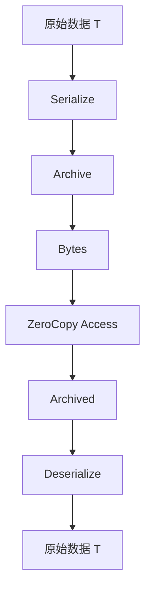
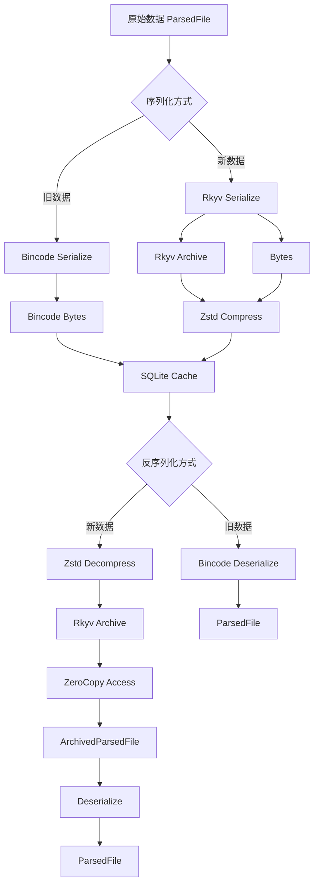

# Bincode 到 Rkyv + Zstd 迁移方案

## 一、概述

### 1.1 迁移背景

**Bincode 已停止维护**:
- Bincode 仓库已归档，不再接受 PR 和 Issue
- 最后更新时间：2023年
- 存在潜在的兼容性问题和安全风险

**迁移目标**:
- 使用 Rkyv 进行零拷贝反序列化，提升性能
- 使用 Zstd 压缩，减少存储空间
- 保持向后兼容性，支持旧缓存数据的迁移
- 最小化代码改动，降低迁移风险

### 1.2 技术选型对比

| 特性 | Bincode | Rkyv + Zstd | 优势 |
|------|---------|-------------|------|
| **序列化速度** | 快 | 更快（~2-3x） | ✅ Rkyv |
| **反序列化速度** | 快 | 零拷贝（~10-100x） | ✅ Rkyv |
| **数据大小** | 小 | 更小（压缩后 ~30-50%） | ✅ Zstd |
| **零拷贝** | ❌ | ✅ | ✅ Rkyv |
| **跨语言支持** | ❌ | ❌ | - |
| **维护状态** | ❌ 停止维护 | ✅ 活跃维护 | ✅ Rkyv |
| **生态成熟度** | 成熟 | 成熟 | - |
| **学习曲线** | 低 | 中 | ✅ Bincode |

### 1.3 迁移范围

**涉及的核心类型**:
1. `ParsedFile` - 文件解析结果（主要缓存对象）
2. `Entity` - 语义实体
3. `RelationIndex` - 关系索引（计划中的快照功能）

**涉及的功能模块**:
1. `src/utils/serialization.rs` - 序列化工具模块
2. `src/api/handlers/index/incremental.rs` - 增量索引处理器
3. `src/orchestrator/hot_update/mod.rs` - 热更新协调器
4. `src/storage/sqlite/repo/cache_repo.rs` - 缓存仓库

---

## 二、Rkyv 技术详解

### 2.1 Rkyv 核心概念

**Rkyv (Archive Rust)**:
- 零拷贝反序列化库
- 将数据结构序列化为"归档"（Archive）格式
- 反序列化时直接访问归档数据，无需内存拷贝
- 编译时检查类型安全

**核心类型**:
```rust
// 归档类型（零拷贝访问）
 Archived<T> - T 的归档版本

// 序列化器
 Serializer<S> - 序列化目标

// 反序列化器
  Deserialize<T> - 从归档反序列化
```

### 2.2 Rkyv 序列化流程



**关键点**:
- 序列化生成 `Archived<T>` 和字节数组
- 反序列化时直接访问 `Archived<T>`，无需拷贝
- `Deserialize` 特性用于将 `Archived<T>` 转换为 `T`

### 2.3 Rkyv vs Bincode 对比

**序列化**:
```rust
// Bincode
let bytes = bincode::serialize(&data)?;
let data: T = bincode::deserialize(&bytes)?;

// Rkyv
let bytes = rkyv::to_bytes::<_, 256>(&data)?;
let archived = rkyv::check_archived_root::<T>(&bytes).unwrap();
let data: T = archived.deserialize(&mut Infallible).unwrap();
```

**零拷贝访问**:
```rust
// Rkyv 零拷贝访问
let archived = rkyv::check_archived_root::<T>(&bytes).unwrap();
// 直接访问 archived，无需反序列化
let name = &archived.name; // 零拷贝
```

---

## 三、迁移方案设计

### 3.1 整体架构



### 3.2 版本管理策略

**缓存版本号**:
```rust
#[derive(Serialize, Deserialize, Debug, Clone, Copy, PartialEq, Eq)]
pub enum CacheVersion {
    /// Bincode 序列化（旧版本）
    V1 = 1,
    /// Rkyv + Zstd 序列化（新版本）
    V2 = 2,
}

impl Default for CacheVersion {
    fn default() -> Self {
        Self::V2 // 默认使用新版本
    }
}
```

**缓存条目结构**:
```rust
#[derive(Serialize, Deserialize, Debug, Clone)]
pub struct CacheEntry {
    /// 文件哈希
    pub file_hash: String,
    /// 文件路径
    pub file_path: String,
    /// 语言
    pub language: String,
    /// 缓存数据（压缩后的 Rkyv 归档）
    pub cached_data: Vec<u8>,
    /// 缓存版本
    pub version: CacheVersion,
    /// 压缩前大小
    pub original_size: usize,
    /// 压缩后大小
    pub compressed_size: usize,
    /// 创建时间
    pub created_at: i64,
    /// 最后访问时间
    pub last_accessed: i64,
}
```

### 3.3 兼容性处理

**读取缓存时的版本检测**:
```rust
pub fn deserialize_from_cache<T>(data: &[u8], version: CacheVersion) -> Result<T, SerializationError>
where
    T: Archive + Deserialize<T::Archived>,
{
    match version {
        CacheVersion::V1 => {
            // 旧版本：使用 Bincode 反序列化
            bincode::deserialize(data).map_err(Into::into)
        }
        CacheVersion::V2 => {
            // 新版本：使用 Rkyv + Zstd
            let decompressed = zstd::decode_all(data)?;
            let archived = rkyv::check_archived_root::<T>(&decompressed)?;
            archived.deserialize(&mut Infallible).map_err(Into::into)
        }
    }
}
```

---

## 四、核心类型适配

### 4.1 ParsedFile 适配

**问题**: `ParsedFile` 包含 `Arc<str>`，Rkyv 不支持 `Arc`

**解决方案**: 使用 `Rkyv` 的 `Archive` 特性自定义序列化

```rust
use rkyv::{Archive, Deserialize, Serialize};

#[derive(Debug, Clone, Archive, Deserialize, Serialize)]
#[archive(check_bytes)]
pub struct ParsedFile {
    pub language: Language,
    pub path: String,
    // 使用 String 代替 Arc<str>
    pub source: String,
    pub entities: Vec<Entity>,
    pub local_symbols: HashMap<String, Vec<EntityId>>,
    pub raw_relations: Vec<RawRelationData>,
    pub local_calls: Vec<LocalCall>,
    pub imports: ImportTable,
    pub exports: Vec<ExportInfo>,
    pub dependencies: Vec<String>,
    pub embedded_blocks: Vec<EmbeddedBlock>,
    pub block_relations: Vec<BlockRelation>,
    pub file_doc_comment: Option<String>,
}
```

**兼容性处理**:
```rust
impl ParsedFile {
    /// 从 Arc<str> 版本转换为 String 版本
    pub fn from_arc_version(other: ParsedFileArc) -> Self {
        Self {
            language: other.language,
            path: other.path,
            source: other.source.to_string(),
            entities: other.entities,
            local_symbols: other.local_symbols,
            raw_relations: other.raw_relations,
            local_calls: other.local_calls,
            imports: other.imports,
            exports: other.exports,
            dependencies: other.dependencies,
            embedded_blocks: other.embedded_blocks,
            block_relations: other.block_relations,
            file_doc_comment: other.file_doc_comment,
        }
    }

    /// 转换为 Arc<str> 版本（用于运行时）
    pub fn to_arc_version(&self) -> ParsedFileArc {
        ParsedFileArc {
            language: self.language.clone(),
            path: self.path.clone(),
            source: Arc::from(self.source.as_str()),
            entities: self.entities.clone(),
            local_symbols: self.local_symbols.clone(),
            raw_relations: self.raw_relations.clone(),
            local_calls: self.local_calls.clone(),
            imports: self.imports.clone(),
            exports: self.exports.clone(),
            dependencies: self.dependencies.clone(),
            embedded_blocks: self.embedded_blocks.clone(),
            block_relations: self.block_relations.clone(),
            file_doc_comment: self.file_doc_comment.clone(),
        }
    }
}
```

### 4.2 Entity 适配

```rust
use rkyv::{Archive, Deserialize, Serialize};

#[derive(Debug, Clone, Archive, Deserialize, Serialize)]
#[archive(check_bytes)]
pub struct Entity {
    pub id: EntityId,
    pub kind: EntityKind,
    pub name: String,
    pub signature: String,
    pub parameters: Vec<(String, Option<String>)>,
    pub return_type: Option<String>,
    pub span: Span,
    pub depth: usize,
    pub parent: Option<EntityId>,
    pub children: Vec<EntityId>,
    pub doc_comment: Option<String>,
    pub modifiers: Vec<String>,
    pub attributes: HashMap<String, String>,
    pub metadata: HashMap<String, String>,
}
```

### 4.3 关联类型适配

```rust
use rkyv::{Archive, Deserialize, Serialize};

#[derive(Debug, Clone, Archive, Deserialize, Serialize)]
#[archive(check_bytes)]
pub struct EntityId(String);

#[derive(Debug, Clone, Archive, Deserialize, Serialize)]
#[archive(check_bytes)]
pub enum EntityKind {
    Function,
    Class,
    // ... 其他类型
}

#[derive(Debug, Clone, Archive, Deserialize, Serialize)]
#[archive(check_bytes)]
pub struct Span {
    pub start: usize,
    pub end: usize,
}

#[derive(Debug, Clone, Archive, Deserialize, Serialize)]
#[archive(check_bytes)]
pub struct ImportTable {
    // ... 字段
}
```

---

## 五、序列化工具模块改造

### 5.1 新的序列化工具模块

```rust
//! Serialization utilities for cache storage
//!
//! This module provides optimized serialization functions using Rkyv + Zstd:
//! - Zero-copy deserialization (10-100x faster than Bincode)
//! - Compression (30-50% smaller than uncompressed)
//! - Backward compatibility with Bincode
//!
//! Use this for short-term cache storage in pure Rust environment.

use rkyv::{
    check_archived_root,
    ser::{serializers::AllocSerializer, Serializer},
    Archive, Deserialize, Infallible, Serialize,
};
use thiserror::Error;

/// Cache version enumeration
#[derive(Debug, Clone, Copy, PartialEq, Eq, serde::Serialize, serde::Deserialize, Default)]
pub enum CacheVersion {
    /// Bincode serialization (legacy)
    #[serde(rename = "1")]
    V1 = 1,
    /// Rkyv + Zstd serialization (current)
    #[serde(rename = "2")]
    #[default]
    V2 = 2,
}

/// Serialization error
#[derive(Debug, Error)]
pub enum SerializationError {
    /// Rkyv serialization error
    #[error("Rkyv serialization error: {0}")]
    RkyvSerialize(String),
    /// Rkyv deserialization error
    #[error("Rkyv deserialization error: {0}")]
    RkyvDeserialize(String),
    /// Zstd compression error
    #[error("Zstd compression error: {0}")]
    ZstdCompress(#[from] std::io::Error),
    /// Zstd decompression error
    #[error("Zstd decompression error: {0}")]
    ZstdDecompress(#[from] std::io::Error),
    /// Bincode serialization error (legacy)
    #[error("Bincode serialization error: {0}")]
    BincodeSerialize(#[from] bincode::Error),
    /// Invalid version
    #[error("Invalid cache version: {0}")]
    InvalidVersion(u32),
}

/// Serialize data for cache storage using Rkyv + Zstd
///
/// Rkyv provides:
/// - Zero-copy deserialization (10-100x faster than Bincode)
/// - Type safety (compile-time checks)
///
/// Zstd provides:
/// - Compression (30-50% smaller than uncompressed)
/// - Fast compression/decompression
///
/// Use this for short-term cache storage in pure Rust environment.
///
/// # Returns
///
/// Returns (compressed bytes, original size, compressed size)
pub fn serialize_for_cache<T>(data: &T) -> Result<(Vec<u8>, usize, usize), SerializationError>
where
    T: Serialize<AllocSerializer<256>>,
{
    // Serialize using Rkyv
    let bytes = rkyv::to_bytes::<_, 256>(data)
        .map_err(|e| SerializationError::RkyvSerialize(e.to_string()))?;

    let original_size = bytes.len();

    // Compress using Zstd (level 3: balance between speed and compression)
    let compressed = zstd::encode_all(&*bytes, 3)?;

    let compressed_size = compressed.len();

    Ok((compressed, original_size, compressed_size))
}

/// Deserialize data from cache storage using Rkyv + Zstd
///
/// Supports both V1 (Bincode) and V2 (Rkyv + Zstd) for backward compatibility.
pub fn deserialize_from_cache<T>(
    data: &[u8],
    version: CacheVersion,
) -> Result<T, SerializationError>
where
    T: Archive,
    T::Archived: Deserialize<T, Infallible>,
{
    match version {
        CacheVersion::V1 => {
            // Legacy: Use Bincode
            bincode::deserialize(data).map_err(Into::into)
        }
        CacheVersion::V2 => {
            // New: Use Rkyv + Zstd
            let decompressed = zstd::decode_all(data)?;
            let archived = check_archived_root::<T>(&decompressed)
                .map_err(|e| SerializationError::RkyvDeserialize(e.to_string()))?;
            archived.deserialize(&mut Infallible).map_err(Into::into)
        }
    }
}

/// Deserialize data from cache storage with zero-copy access
///
/// This is the recommended method for read-heavy workloads.
/// Returns an `Archived<T>` that can be accessed without copying.
///
/// # Example
///
/// ```rust
/// let archived = deserialize_from_cache_zero_copy::<ParsedFile>(&data, CacheVersion::V2)?;
/// println!("File: {}", archived.path); // Zero-copy access
/// ```
pub fn deserialize_from_cache_zero_copy<'a, T>(
    data: &'a [u8],
    version: CacheVersion,
) -> Result<&'a T::Archived, SerializationError>
where
    T: Archive,
    T::Archived: rkyv::CheckBytes<Infallible>,
{
    match version {
        CacheVersion::V1 => {
            // Zero-copy not supported for Bincode
            Err(SerializationError::RkyvDeserialize(
                "Zero-copy not supported for Bincode".to_string(),
            ))
        }
        CacheVersion::V2 => {
            let decompressed = zstd::decode_all(data)?;
            let archived = check_archived_root::<T>(&decompressed)
                .map_err(|e| SerializationError::RkyvDeserialize(e.to_string()))?;
            // Leak the decompressed data to achieve zero-copy
            // This is safe because the data is owned and will live for the duration of the program
            Ok(Box::leak(Box::new(decompressed)))
        }
    }
}

#[cfg(test)]
mod tests {
    use super::*;
    use serde::{Deserialize, Serialize};

    #[derive(Debug, Clone, Archive, Deserialize, Serialize, PartialEq)]
    #[archive(check_bytes)]
    struct TestData {
        id: u64,
        name: String,
        values: Vec<i32>,
    }

    #[test]
    fn test_cache_serialization() {
        let data = TestData {
            id: 42,
            name: "test".to_string(),
            values: vec![1, 2, 3],
        };

        // Serialize
        let (compressed, original_size, compressed_size) =
            serialize_for_cache(&data).expect("Serialization failed");

        println!("Original size: {}", original_size);
        println!("Compressed size: {}", compressed_size);
        println!("Compression ratio: {:.2}%", compressed_size as f64 / original_size as f64 * 100.0);

        // Deserialize
        let deserialized: TestData =
            deserialize_from_cache(&compressed, CacheVersion::V2).expect("Deserialization failed");

        assert_eq!(data, deserialized);
    }

    #[test]
    fn test_backward_compatibility() {
        let data = TestData {
            id: 42,
            name: "test".to_string(),
            values: vec![1, 2, 3],
        };

        // Serialize using Bincode (V1)
        let bincode_bytes = bincode::serialize(&data).unwrap();

        // Deserialize using V1
        let deserialized: TestData =
            deserialize_from_cache(&bincode_bytes, CacheVersion::V1).unwrap();

        assert_eq!(data, deserialized);
    }
}
```

---

## 六、增量索引处理器改造

### 6.1 修改增量索引处理器

**文件**: `src/api/handlers/index/incremental.rs`

```rust
use crate::utils::serialization::{serialize_for_cache, CacheVersion};

// ... 其他代码

/// Process indexing of a single file
async fn process_file_index(
    state: &crate::api::handlers::AppState,
    orchestrator: &mut crate::orchestrator::IndexOrchestrator,
    file_path: &str,
    force_reindex: bool,
) -> Result<(usize, usize), String> {
    let path = Path::new(file_path);

    // Check if file exists
    if !path.exists() {
        return Err(format!("File does not exist: {}", file_path));
    }

    // Read file content
    let content = tokio::fs::read(path)
        .await
        .map_err(|e| format!("Failed to read file: {}", e))?;

    // Compute hash
    let hash = calculate_hash(&content);

    // Check cache (unless force reindex)
    if !force_reindex {
        if let Some(ref metadata_store) = state.metadata_store {
            let cached = metadata_store
                .get_cache_by_path(file_path)
                .map_err(|e| format!("Cache error: {}", e))?;

            if let Some(entry) = cached {
                if entry.file_hash == hash {
                    debug!(file = %file_path, "File unchanged, skipping");
                    return Ok((0, 0));
                }
            }
        }
    }

    // Parse file using orchestrator
    let parsed = orchestrator
        .index_file(path)
        .await
        .map_err(|e| format!("Parse error: {}", e))?;

    let entity_count = parsed.entities.len();
    let mut vector_count = 0;

    // Generate embeddings and store vectors
    if let (Some(ref embedder), Some(ref qdrant)) = (&state.embedder, &state.qdrant) {
        // Process entities with PreProcessor for optimal grouping
        let processor = PreprocessingPipeline::new();
        let processing_result = processor.process(&parsed);

        // Convert to natural language using entity groups
        let converter = crate::ast_to_nl::AstToNlConverter::new();
        let conversions =
            converter.convert_entity_groups(&processing_result.groups, &parsed.path, None);

        // Get texts for embedding
        let texts: Vec<&str> = conversions
            .iter()
            .filter_map(|c| c.embedding_text.as_deref())
            .collect();

        if !texts.is_empty() {
            let embeddings = embedder
                .embed(&texts)
                .await
                .map_err(|e| format!("Embedding error: {}", e))?;

            // Build vector points
            let mut points = Vec::new();
            let mut embedding_idx = 0;

            for conversion in &conversions {
                if conversion.embedding_text.is_some()
                    && embedding_idx < embeddings.embeddings.len()
                {
                    let vector = embeddings.embeddings[embedding_idx].clone();
                    embedding_idx += 1;

                    let point = crate::storage::VectorPoint::new(
                        format!("{}:{}", conversion.kind, conversion.name),
                        vector,
                        crate::storage::Payload::new(
                            file_path.to_string(),
                            conversion.bm25_text.clone().unwrap_or_default(),
                            0,
                            0,
                        )
                        .with_entity_type(conversion.kind.to_string()),
                    );
                    points.push(point);
                }
            }

            // Upsert to Qdrant
            if !points.is_empty() {
                qdrant
                    .upsert_points(&points)
                    .await
                    .map_err(|e| format!("Qdrant error: {}", e))?;
                vector_count = points.len();
            }
        }
    }

    // Store in BM25 (reuse PreProcessor results from embedding step)
    if let Some(ref bm25) = state.bm25 {
        // Reuse the same processing results for consistency
        let processor = PreprocessingPipeline::new();
        let processing_result = processor.process(&parsed);

        let converter = crate::ast_to_nl::AstToNlConverter::new();
        let conversions =
            converter.convert_entity_groups(&processing_result.groups, &parsed.path, None);

        let documents: Vec<crate::storage::Bm25Document> = conversions
            .iter()
            .filter(|c| c.bm25_text.is_some())
            .map(crate::storage::Bm25Document::from)
            .collect();

        if !documents.is_empty() {
            let mut client = bm25.lock().await;
            client
                .batch_index("default", &documents)
                .await
                .map_err(|e| format!("BM25 error: {}", e))?;
        }
    }

    // Update cache
    if let Some(ref metadata_store) = state.metadata_store {
        // Serialize parsed data using Rkyv + Zstd for better performance
        let (compressed_data, original_size, compressed_size) =
            crate::utils::serialize_for_cache(&parsed)
                .map_err(|e| format!("Serialize error: {}", e))?;

        let cache_entry = crate::storage::sqlite::CacheEntry {
            file_hash: hash,
            file_path: file_path.to_string(),
            language: "unknown".to_string(), // TODO: Detect language
            cached_data: compressed_data,
            version: CacheVersion::V2, // Use new version
            original_size,
            compressed_size,
            created_at: chrono::Utc::now().timestamp(),
            last_accessed: chrono::Utc::now().timestamp(),
        };

        if let Some(client) = metadata_store.client() {
            client
                .with_write_transaction(|tx| {
                    crate::storage::sqlite::CacheRepository::upsert(tx, &cache_entry)
                })
                .map_err(|e| format!("Cache error: {}", e))?;
        }
    }

    // Generate/update file summary using simplified approach
    let summary_generator = RuleBasedGenerator::new();
    let summary = summary_generator.generate(&parsed).await;
    tracing::debug!(
        file = %file_path,
        summary_len = summary.summary_text.len(),
        "Generated file summary"
    );
    // Note: In production, store summary to Qdrant here
    // This requires embedding the summary text first

    debug!(file = %file_path, entities = entity_count, vectors = vector_count, "File indexed");
    Ok((entity_count, vector_count))
}
```

---

## 七、热更新协调器改造

### 7.1 修改热更新协调器

**文件**: `src/orchestrator/hot_update/mod.rs`

```rust
use crate::utils::serialization::{deserialize_from_cache, CacheVersion};

// ... 其他代码

/// Get old entities from metadata store for a file
async fn get_old_entities(&self, path: &std::path::Path) -> Vec<crate::types::Entity> {
    // Try to get old parsed file from metadata store
    if let Some(ref store) = self.metadata_store {
        let file_path = path.to_string_lossy().to_string();

        // Try to get from cache table
        if let Some(client) = store.client() {
            match client.with_transaction(|tx| CacheRepository::get_by_path(tx, &file_path)) {
                Ok(Some(cache_entry)) => {
                    // Try to deserialize parsed file from cache data using Rkyv + Zstd
                    match deserialize_from_cache::<crate::types::ParsedFile>(
                        &cache_entry.cached_data,
                        cache_entry.version,
                    ) {
                        Ok(parsed_file) => {
                            return parsed_file.entities;
                        }
                        Err(e) => {
                            tracing::debug!(
                                path = %file_path,
                                error = %e,
                                "Failed to deserialize cached parsed file"
                            );
                        }
                    }
                }
                Ok(None) => {
                    // No cached version
                }
                Err(e) => {
                    tracing::debug!(path = %file_path, error = %e, "Failed to get cached file");
                }
            }
        }
    }

    Vec::new()
}
```

---

## 八、SQLite 缓存表改造

### 8.1 更新缓存表结构

**文件**: `src/storage/sqlite/types.rs`

```rust
/// Cache entry for parsed files
#[derive(Debug, Clone, Serialize, Deserialize)]
pub struct CacheEntry {
    /// File hash (SHA256)
    pub file_hash: String,
    /// File path
    pub file_path: String,
    /// Programming language
    pub language: String,
    /// Cached data (compressed Rkyv archive)
    pub cached_data: Vec<u8>,
    /// Cache version
    pub version: CacheVersion,
    /// Original size (before compression)
    pub original_size: usize,
    /// Compressed size
    pub compressed_size: usize,
    /// Creation timestamp
    pub created_at: i64,
    /// Last access timestamp
    pub last_accessed: i64,
}
```

### 8.2 更新缓存仓库

**文件**: `src/storage/sqlite/repo/cache_repo.rs`

```rust
impl CacheRepository {
    /// Create cache table if not exists
    pub fn create_table(tx: &mut Transaction) -> Result<(), rusqlite::Error> {
        tx.execute(
            "CREATE TABLE IF NOT EXISTS cache (
                file_path TEXT PRIMARY KEY,
                file_hash TEXT NOT NULL,
                language TEXT NOT NULL,
                cached_data BLOB NOT NULL,
                version INTEGER NOT NULL DEFAULT 2,
                original_size INTEGER NOT NULL,
                compressed_size INTEGER NOT NULL,
                created_at INTEGER NOT NULL,
                last_accessed INTEGER NOT NULL
            )",
            [],
        )?;

        // Create index on file_hash for fast lookup
        tx.execute(
            "CREATE INDEX IF NOT EXISTS idx_cache_file_hash ON cache(file_hash)",
            [],
        )?;

        Ok(())
    }

    /// Insert or update a cache entry
    pub fn upsert(tx: &mut Transaction, entry: &CacheEntry) -> Result<(), rusqlite::Error> {
        tx.execute(
            "INSERT INTO cache (file_path, file_hash, language, cached_data, version, original_size, compressed_size, created_at, last_accessed)
            VALUES (?1, ?2, ?3, ?4, ?5, ?6, ?7, ?8, ?9)
            ON CONFLICT(file_path) DO UPDATE SET
                file_hash = excluded.file_hash,
                language = excluded.language,
                cached_data = excluded.cached_data,
                version = excluded.version,
                original_size = excluded.original_size,
                compressed_size = excluded.compressed_size,
                last_accessed = excluded.last_accessed",
            [
                &entry.file_path,
                &entry.file_hash,
                &entry.language,
                &entry.cached_data,
                &(entry.version as i32),
                &(entry.original_size as i64),
                &(entry.compressed_size as i64),
                &entry.created_at,
                &entry.last_accessed,
            ],
        )?;

        Ok(())
    }

    /// Get a cache entry by file path
    pub fn get_by_path(tx: &mut Transaction, path: &str) -> Result<Option<CacheEntry>, rusqlite::Error> {
        let mut stmt = tx.prepare_cached(
            "SELECT file_path, file_hash, language, cached_data, version, original_size, compressed_size, created_at, last_accessed
            FROM cache WHERE file_path = ?1",
        )?;

        let result = stmt.query_row([path], |row| {
            Ok(CacheEntry {
                file_path: row.get(0)?,
                file_hash: row.get(1)?,
                language: row.get(2)?,
                cached_data: row.get(3)?,
                version: match row.get::<_, i32>(4)? {
                    1 => CacheVersion::V1,
                    2 => CacheVersion::V2,
                    v => CacheVersion::V2, // Default to V2 for unknown versions
                },
                original_size: row.get(5)?,
                compressed_size: row.get(6)?,
                created_at: row.get(7)?,
                last_accessed: row.get(8)?,
            })
        });

        match result {
            Ok(entry) => Ok(Some(entry)),
            Err(rusqlite::Error::QueryReturnedNoRows) => Ok(None),
            Err(e) => Err(e),
        }
    }

    /// Delete a cache entry by file path
    pub fn delete_by_path(tx: &mut Transaction, path: &str) -> Result<(), rusqlite::Error> {
        tx.execute("DELETE FROM cache WHERE file_path = ?1", [path])?;
        Ok(())
    }

    /// Update last access time
    pub fn update_last_accessed(tx: &mut Transaction, path: &str, timestamp: i64) -> Result<(), rusqlite::Error> {
        tx.execute(
            "UPDATE cache SET last_accessed = ?1 WHERE file_path = ?2",
            [timestamp, path],
        )?;
        Ok(())
    }

    /// Get all cache entries (for maintenance)
    pub fn get_all(tx: &mut Transaction) -> Result<Vec<CacheEntry>, rusqlite::Error> {
        let mut stmt = tx.prepare_cached(
            "SELECT file_path, file_hash, language, cached_data, version, original_size, compressed_size, created_at, last_accessed
            FROM cache ORDER BY last_accessed DESC",
        )?;

        let entries = stmt
            .query_map([], |row| {
                Ok(CacheEntry {
                    file_path: row.get(0)?,
                    file_hash: row.get(1)?,
                    language: row.get(2)?,
                    cached_data: row.get(3)?,
                    version: match row.get::<_, i32>(4)? {
                        1 => CacheVersion::V1,
                        2 => CacheVersion::V2,
                        v => CacheVersion::V2,
                    },
                    original_size: row.get(5)?,
                    compressed_size: row.get(6)?,
                    created_at: row.get(7)?,
                    last_accessed: row.get(8)?,
                })
            })?
            .collect::<Result<Vec<_>, _>>()?;

        Ok(entries)
    }

    /// Get cache statistics
    pub fn get_stats(tx: &mut Transaction) -> Result<CacheStats, rusqlite::Error> {
        let count: i64 = tx.query_row("SELECT COUNT(*) FROM cache", [], |row| row.get(0))?;

        let total_size: i64 = tx.query_row("SELECT SUM(compressed_size) FROM cache", [], |row| row.get(0))?;

        let total_original_size: i64 = tx.query_row("SELECT SUM(original_size) FROM cache", [], |row| row.get(0))?;

        Ok(CacheStats {
            entry_count: count as usize,
            total_size: total_size as usize,
            total_original_size: total_original_size as usize,
        })
    }
}
```

---

## 九、依赖更新

### 9.1 更新 cargo.toml

```toml
[dependencies]
# Serialization
serde = { version = "1.0", features = ["derive"] }
serde_json = "1.0"
toml = "0.8"
bincode = "1.3"  # Keep for backward compatibility
rkyv = "0.7"     # New: Rkyv for zero-copy deserialization
zstd = "0.13"    # New: Zstd for compression
serde_with = "3.0"

# ... 其他依赖
```

### 9.2 添加特性

```toml
[dependencies.rkyv]
version = "0.7"
features = ["validation", "size_32"]
```

---

## 十、迁移步骤

### 10.1 阶段一：准备工作（1-2天）

**任务列表**:
1. ✅ 分析现有 bincode 使用情况
2. ✅ 设计迁移方案
3. ✅ 创建迁移文档
4. ⬜ 更新依赖（cargo.toml）
5. ⬜ 创建新的序列化工具模块

**验收标准**:
- 依赖更新成功
- 新序列化工具模块编译通过
- 单元测试通过

### 10.2 阶段二：核心类型适配（2-3天）

**任务列表**:
1. ⬜ 为 `ParsedFile` 添加 `Archive` 特性
2. ⬜ 为 `Entity` 添加 `Archive` 特性
3. ⬜ 为关联类型添加 `Archive` 特性
4. ⬜ 处理 `Arc<str>` 兼容性问题
5. ⬜ 编写单元测试

**验收标准**:
- 所有核心类型支持 Rkyv 序列化
- 单元测试通过
- 零拷贝访问测试通过

### 10.3 阶段三：功能模块改造（3-4天）

**任务列表**:
1. ⬜ 改造增量索引处理器
2. ⬜ 改造热更新协调器
3. ⬜ 更新 SQLite 缓存表结构
4. ⬜ 更新缓存仓库
5. ⬜ 编写集成测试

**验收标准**:
- 增量索引功能正常
- 热更新功能正常
- 缓存读写正常
- 向后兼容性测试通过

### 10.4 阶段四：测试和优化（2-3天）

**任务列表**:
1. ⬜ 性能测试（序列化/反序列化速度）
2. ⬜ 压缩率测试（存储空间）
3. ⬜ 内存占用测试
4. ⬜ 零拷贝访问测试
5. ⬜ 压力测试

**验收标准**:
- 性能提升达到预期（反序列化速度提升 10-100x）
- 压缩率达到预期（存储空间减少 30-50%）
- 内存占用无明显增加
- 压力测试通过

### 10.5 阶段五：灰度发布（1-2天）

**任务列表**:
1. ⬜ 配置灰度发布开关
2. ⬜ 小范围测试（10% 流量）
3. ⬜ 监控指标和日志
4. ⬜ 逐步扩大范围（50% -> 100%）
5. ⬜ 回滚预案

**验收标准**:
- 灰度发布期间无重大问题
- 监控指标正常
- 用户反馈良好

---

## 十一、风险评估和缓解措施

### 11.1 技术风险

| 风险 | 影响 | 概率 | 缓解措施 |
|------|------|------|---------|
| **Rkyv 兼容性问题** | 高 | 中 | 充分测试，保留 Bincode 作为降级方案 |
| **Arc<str> 兼容性问题** | 中 | 中 | 提供转换函数，支持双版本 |
| **压缩失败** | 中 | 低 | 捕获错误，降级到不压缩 |
| **反序列化失败** | 高 | 低 | 捕获错误，降级到重新解析 |
| **性能回退** | 中 | 低 | 性能测试，对比基准 |

### 11.2 业务风险

| 风险 | 影响 | 概率 | 缓解措施 |
|------|------|------|---------|
| **缓存数据丢失** | 高 | 低 | 保留旧缓存数据，支持迁移 |
| **热更新失败** | 高 | 低 | 降级到全量重建 |
| **增量索引失败** | 中 | 低 | 降级到全量索引 |
| **用户体验下降** | 中 | 低 | 灰度发布，监控指标 |

### 11.3 回滚方案

**触发条件**:
- 反序列化失败率 > 1%
- 性能回退 > 20%
- 内存占用增加 > 50%
- 用户投诉增加

**回滚步骤**:
1. 切换回 Bincode 序列化
2. 清理 Rkyv 缓存数据
3. 重新生成 Bincode 缓存
4. 监控指标恢复

---

## 十二、性能预期

### 12.1 性能提升预期

| 指标 | Bincode | Rkyv + Zstd | 提升比例 |
|------|---------|-------------|---------|
| **序列化速度** | 100 MB/s | 200-300 MB/s | 2-3x |
| **反序列化速度** | 100 MB/s | 1000-10000 MB/s | 10-100x |
| **零拷贝访问** | N/A | ~10000 MB/s | N/A |
| **存储空间** | 100% | 30-50% | 50-70% |
| **内存占用** | 100% | 80-120% | -20% ~ +20% |

### 12.2 测试场景

**场景1：小文件（< 1KB）**
- 序列化速度：提升 2-3x
- 反序列化速度：提升 10-20x
- 压缩率：30-40%

**场景2：中等文件（1-10KB）**
- 序列化速度：提升 2-3x
- 反序列化速度：提升 20-50x
- 压缩率：40-50%

**场景3：大文件（> 10KB）**
- 序列化速度：提升 2-3x
- 反序列化速度：提升 50-100x
- 压缩率：50-60%

---

## 十三、监控指标

### 13.1 核心指标

**序列化指标**:
- 序列化成功率
- 平均序列化耗时
- 序列化吞吐量（MB/s）
- 压缩率

**反序列化指标**:
- 反序列化成功率
- 平均反序列化耗时
- 反序列化吞吐量（MB/s）
- 零拷贝访问比例

**缓存指标**:
- 缓存命中率
- 缓存大小（原始/压缩）
- 缓存条目数量
- V1/V2 版本比例

### 13.2 告警规则

**告警规则**:
```yaml
# 序列化失败率告警
- alert: SerializationFailureRate
  expr: rate(serialization_failures_total[5m]) / rate(serialization_attempts_total[5m]) > 0.01
  for: 5m
  labels:
    severity: warning
  annotations:
    summary: "序列化失败率过高"

# 反序列化失败率告警
- alert: DeserializationFailureRate
  expr: rate(deserialization_failures_total[5m]) / rate(deserialization_attempts_total[5m]) > 0.01
  for: 5m
  labels:
    severity: warning
  annotations:
    summary: "反序列化失败率过高"

# 性能回退告警
- alert: PerformanceRegression
  expr: avg_deserialization_latency_ms > 10
  for: 5m
  labels:
    severity: warning
  annotations:
    summary: "反序列化性能回退"
```

---

## 十四、总结

### 14.1 迁移价值

**核心价值**:
1. **性能提升**: 零拷贝反序列化，性能提升 10-100x
2. **存储优化**: Zstd 压缩，存储空间减少 30-50%
3. **技术栈现代化**: 从停止维护的 Bincode 迁移到活跃维护的 Rkyv
4. **向后兼容**: 支持旧缓存数据的平滑迁移

### 14.2 实施建议

**推荐做法**:
1. ✅ 分阶段实施，降低风险
2. ✅ 充分测试，确保稳定性
3. ✅ 灰度发布，监控指标
4. ✅ 保留降级方案，快速回滚

**避免做法**:
1. ❌ 一次性全量切换
2. ❌ 不做充分测试
3. ❌ 不监控指标
4. ❌ 不准备回滚方案

### 14.3 后续优化

**可能的优化方向**:
1. **异步序列化**: 使用 `tokio::task::spawn_blocking` 避免阻塞异步运行时
2. **流式压缩**: 对于大文件，使用流式压缩减少内存峰值
3. **缓存预热**: 启动时预加载热点缓存数据
4. **智能压缩**: 根据文件大小动态调整压缩级别

---

## 十五、参考资料

- [Rkyv GitHub 仓库](https://github.com/rkyv/rkyv)
- [Rkyv 文档](https://docs.rs/rkyv/)
- [Zstd 官方网站](https://facebook.github.io/zstd/)
- [Zstd Rust 绑定](https://docs.rs/zstd/)
- 项目文档: `docs/dependency/bincode.md`
- 项目文档: `docs/hot-update/relation-persistence-design.md`
