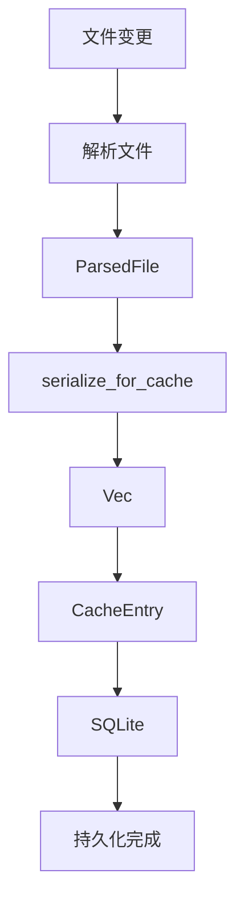
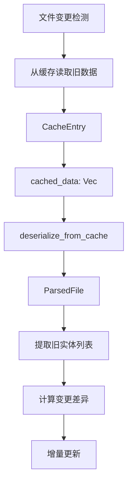
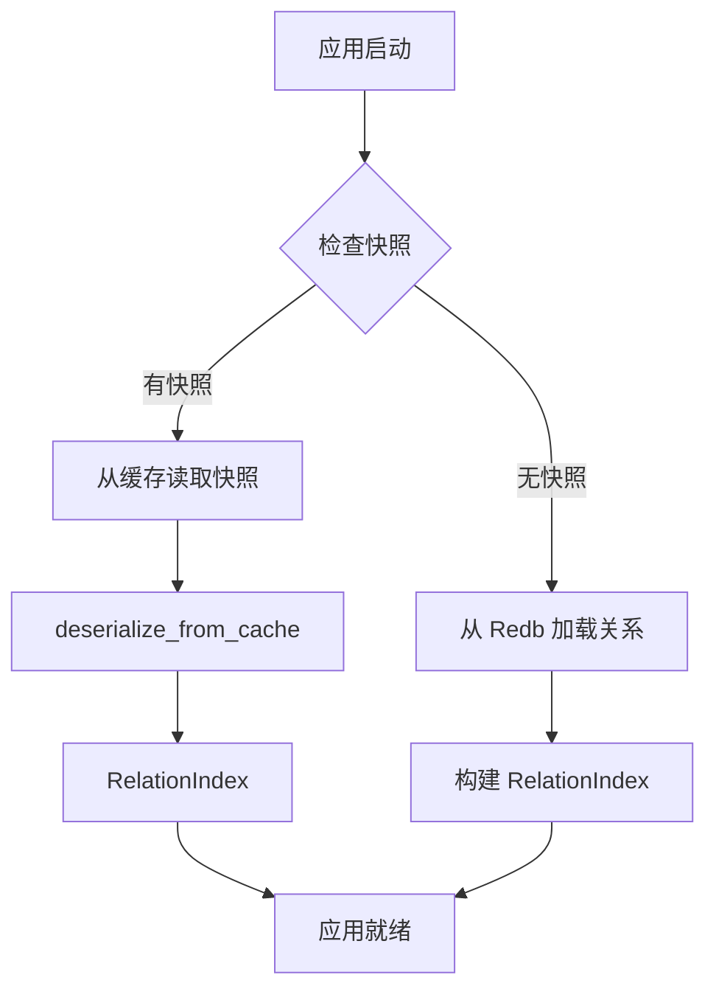

# Bincode 依赖分析

## 一、概述

**Bincode** 是一个用于 Rust 的二进制序列化/反序列化库，专注于性能和紧凑的存储格式。它在项目中主要用于缓存数据的序列化和反序列化，提供高性能的存储和检索能力。

### 1.1 基本信息

- **版本**: 1.3
- **分类**: Serialization（序列化）
- **用途**: 缓存数据的二进制序列化
- **依赖位置**: `cargo.toml:26`

### 1.2 核心特性

- **高性能**: 比 MessagePack 快 25%
- **紧凑存储**: 比 MessagePack 小 15%
- **零拷贝反序列化**: 支持零拷贝反序列化，减少内存分配
- **类型安全**: 基于 Rust 的类型系统，编译时检查
- **二进制格式**: 使用紧凑的二进制格式，适合存储和传输

---

## 二、项目中的使用场景

### 2.1 缓存序列化工具模块

**文件**: `src/utils/serialization.rs`

**职责**: 提供统一的缓存序列化接口，封装 bincode 的使用。

**核心函数**:

```rust
/// 序列化数据用于缓存存储
pub fn serialize_for_cache<T: Serialize>(data: &T) -> Result<Vec<u8>, SerializationError>

/// 从缓存存储反序列化数据
pub fn deserialize_from_cache<T: DeserializeOwned>(data: &[u8]) -> Result<T, SerializationError>
```

**使用场景**:
- 将 `ParsedFile` 对象序列化为二进制数据
- 将序列化后的数据存储到 SQLite 缓存表中
- 从缓存中读取二进制数据并反序列化为 `ParsedFile` 对象

**优势**:
- 统一的错误处理（`SerializationError`）
- 清晰的文档说明性能优势
- 便于未来替换序列化方案

### 2.2 增量索引处理器

**文件**: `src/api/handlers/index/incremental.rs`

**职责**: 处理增量索引请求，更新缓存数据。

**使用位置**: `src/api/handlers/index/incremental.rs:250-252`

```rust
// Serialize parsed data using bincode for better performance
let data = crate::utils::serialize_for_cache(&parsed)
    .map_err(|e| format!("Serialize error: {}", e))?;
```

**使用场景**:
- 在增量索引时，将解析后的 `ParsedFile` 对象序列化
- 将序列化后的数据存储到 `CacheEntry` 的 `cached_data` 字段
- 通过 `metadata_store` 持久化到 SQLite 数据库

**数据流**:
```
ParsedFile → serialize_for_cache() → Vec<u8> → CacheEntry → SQLite
```

### 2.3 热更新协调器

**文件**: `src/orchestrator/hot_update/mod.rs`

**职责**: 协调热更新流程，检测文件变更并处理。

**使用位置**: `src/orchestrator/hot_update/mod.rs:473-486`

```rust
// Try to deserialize parsed file from cache data using bincode
match crate::utils::deserialize_from_cache::<crate::types::ParsedFile>(
    &cache_entry.cached_data,
) {
    Ok(parsed_file) => {
        return parsed_file.entities;
    }
    Err(e) => {
        tracing::debug!(
            path = %file_path,
            error = %e,
            "Failed to deserialize cached parsed file"
        );
    }
}
```

**使用场景**:
- 在热更新时，从缓存中读取旧版本的 `ParsedFile` 对象
- 反序列化缓存数据以获取旧的实体列表
- 用于计算实体变更差异（新增、修改、删除）

**数据流**:
```
SQLite → CacheEntry → cached_data → deserialize_from_cache() → ParsedFile → Vec<Entity>
```

### 2.4 关系持久化设计（计划中）

**文件**: `docs/hot-update/relation-persistence-design.md`

**职责**: 描述 Relation 模块的持久化设计方案。

**使用位置**: `docs/hot-update/relation-persistence-design.md:193,552,553`

```markdown
- 使用 bincode 高效序列化
```

**使用场景**:
- 在快照创建时，使用 bincode 序列化 `RelationIndex` 对象
- 在冷启动恢复时，使用 bincode 反序列化快照数据
- 与 zstd 压缩结合，进一步减少快照大小

**优势**:
- 高性能序列化，减少快照创建时间
- 紧凑的二进制格式，减少存储空间
- 零拷贝反序列化，加速冷启动恢复

---

## 三、与其他序列化方案的对比

### 3.1 项目中的序列化方案

| 方案 | 用途 | 文件 |
|------|------|------|
| **bincode** | 缓存数据序列化（高性能、紧凑） | `src/utils/serialization.rs` |
| **serde_json** | API 请求/响应序列化（可读性好） | `src/api/handlers/` |
| **toml** | 配置文件序列化（人类可读） | `src/config/` |
| **MessagePack** | 未使用（被 bincode 替代） | - |

### 3.2 性能对比（来自项目文档）

| 指标 | Bincode | MessagePack | 优势 |
|------|---------|-------------|------|
| **序列化速度** | 快 25% | 基准 | ✅ Bincode |
| **数据大小** | 小 15% | 基准 | ✅ Bincode |
| **零拷贝支持** | ✅ | ❌ | ✅ Bincode |
| **可读性** | ❌ | ❌ | - |
| **跨语言支持** | ❌ | ✅ | ✅ MessagePack |

### 3.3 选择理由

**为什么选择 bincode 用于缓存？**

1. **纯 Rust 环境**: 缓存数据只在 Rust 进程内部使用，无需跨语言支持
2. **性能优先**: 缓存读写频繁，需要高性能序列化
3. **存储紧凑**: 缓存数据量大，需要紧凑的存储格式
4. **类型安全**: 编译时检查类型，减少运行时错误

**为什么不用 MessagePack？**

- MessagePack 的跨语言支持在纯 Rust 环境中是冗余的
- Bincode 的性能和存储优势更符合缓存场景的需求
- 项目已经选择了 bincode，无需引入额外的依赖

---

## 四、数据流分析

### 4.1 增量索引流程



**关键点**:
- 序列化发生在文件解析之后
- 序列化数据存储在 SQLite 的 `cached_data` 字段
- 序列化失败不会影响索引更新（降级处理）

### 4.2 热更新流程



**关键点**:
- 反序列化用于获取旧版本的实体列表
- 反序列化失败时，降级为空实体列表（视为新文件）
- 变更差异计算依赖于反序列化的准确性

### 4.3 冷启动恢复流程（计划中）



**关键点**:
- 快照使用 bincode 序列化，加速冷启动
- 快照无效时，降级到从 Redb 加载
- 零拷贝反序列化减少内存分配

---

## 五、错误处理

### 5.1 错误类型定义

**文件**: `src/utils/serialization.rs:15-18`

```rust
#[derive(Debug, Error)]
pub enum SerializationError {
    /// Bincode serialization error
    #[error("Bincode serialization error: {0}")]
    BincodeSerialize(#[from] bincode::Error),
}
```

**特点**:
- 使用 `thiserror` 简化错误处理
- 自动从 `bincode::Error` 转换
- 清晰的错误消息

### 5.2 错误处理策略

| 场景 | 错误处理 | 影响 |
|------|---------|------|
| **序列化失败**（增量索引） | 记录错误，返回 HTTP 500 | 索引失败，客户端重试 |
| **反序列化失败**（热更新） | 记录 debug 日志，降级为空列表 | 视为新文件，全量更新 |
| **反序列化失败**（冷启动） | 降级到从 Redb 加载 | 恢复时间增加，不影响功能 |

### 5.3 错误恢复

**增量索引场景**:
```rust
let data = crate::utils::serialize_for_cache(&parsed)
    .map_err(|e| format!("Serialize error: {}", e))?;
```
- 序列化失败会导致整个索引请求失败
- 客户端收到错误后可以重试

**热更新场景**:
```rust
match crate::utils::deserialize_from_cache::<crate::types::ParsedFile>(
    &cache_entry.cached_data,
) {
    Ok(parsed_file) => {
        return parsed_file.entities;
    }
    Err(e) => {
        tracing::debug!(...); // 仅记录日志
    }
}
Vec::new() // 降级为空列表
```
- 反序列化失败不会阻断更新流程
- 降级为空列表，视为新文件处理

---

## 六、性能优化

### 6.1 性能优势

**来自项目文档的说明**:
- **高性能**: 比 MessagePack 快 25%
- **紧凑存储**: 比 MessagePack 小 15%
- **零拷贝反序列化**: 减少内存分配和复制

### 6.2 优化建议

**当前实现**:
```rust
pub fn serialize_for_cache<T: Serialize>(data: &T) -> Result<Vec<u8>, SerializationError> {
    bincode::serialize(data).map_err(Into::into)
}
```

**潜在优化**:
1. **使用 `bincode::config()`**: 配置序列化选项，如固定整数大小
2. **使用 `bincode::serialize_into()`**: 直接写入 `Vec<u8>`，避免中间分配
3. **使用 `bincode::deserialize_from()`**: 零拷贝反序列化（需要 `Cow` 支持）

**示例优化**:
```rust
pub fn serialize_for_cache<T: Serialize>(data: &T) -> Result<Vec<u8>, SerializationError> {
    let mut buffer = Vec::new();
    bincode::serialize_into(&mut buffer, data)?;
    Ok(buffer)
}
```

### 6.3 压缩结合（计划中）

**关系持久化设计**:
```markdown
- 使用 bincode 高效序列化
- 压缩快照数据（使用 zstd）
```

**优势**:
- Bincode 提供紧凑的二进制格式
- Zstd 进一步压缩，减少存储空间
- 组合使用，兼顾性能和存储效率

---

## 七、测试覆盖

### 7.1 单元测试

**文件**: `src/utils/serialization.rs:38-67`

```rust
#[cfg(test)]
mod tests {
    use super::*;
    use serde::{Deserialize, Serialize};

    #[derive(Debug, Clone, Serialize, Deserialize, PartialEq)]
    struct TestData {
        id: u64,
        name: String,
        values: Vec<i32>,
    }

    #[test]
    fn test_cache_serialization() {
        let data = TestData {
            id: 42,
            name: "test".to_string(),
            values: vec![1, 2, 3],
        };

        // Serialize
        let serialized = serialize_for_cache(&data).expect("Serialization failed");

        // Deserialize
        let deserialized: TestData =
            deserialize_from_cache(&serialized).expect("Deserialization failed");

        assert_eq!(data, deserialized);
    }
}
```

**测试覆盖**:
- ✅ 基本序列化/反序列化
- ✅ 数据完整性验证
- ❌ 错误处理测试
- ❌ 性能测试
- ❌ 零拷贝反序列化测试

### 7.2 集成测试

**建议添加的测试**:
1. **增量索引集成测试**: 测试序列化后的数据能否正确存储和检索
2. **热更新集成测试**: 测试反序列化失败时的降级逻辑
3. **冷启动恢复测试**: 测试快照序列化和反序列化的完整性

---

## 八、潜在风险和改进建议

### 8.1 潜在风险

| 风险 | 影响 | 概率 | 缓解措施 |
|------|------|------|---------|
| **版本兼容性** | 旧缓存数据无法反序列化 | 中 | 使用版本号管理，提供兼容层 |
| **数据损坏** | 反序列化失败，降级处理 | 低 | 定期校验缓存数据，自动重建 |
| **性能瓶颈** | 大对象序列化慢 | 低 | 分批序列化，异步处理 |
| **内存占用** | 序列化时内存峰值高 | 中 | 使用流式序列化，限制对象大小 |

### 8.2 改进建议

**1. 版本管理**:
```rust
#[derive(Serialize, Deserialize)]
struct CacheEntry {
    version: u32, // 添加版本号
    data: Vec<u8>,
}
```

**2. 数据校验**:
```rust
pub fn serialize_with_checksum<T: Serialize>(data: &T) -> Result<Vec<u8>, SerializationError> {
    let serialized = bincode::serialize(data)?;
    let checksum = sha2::Sha256::digest(&serialized);
    Ok([serialized, checksum.to_vec()].concat())
}
```

**3. 压缩支持**:
```rust
pub fn serialize_with_compression<T: Serialize>(data: &T) -> Result<Vec<u8>, SerializationError> {
    let serialized = bincode::serialize(data)?;
    Ok(zstd::encode_all(&*serialized, 3)?) // 压缩级别 3
}
```

**4. 异步序列化**:
```rust
pub async fn serialize_async<T: Serialize>(data: &T) -> Result<Vec<u8>, SerializationError> {
    tokio::task::spawn_blocking(move || {
        bincode::serialize(data).map_err(Into::into)
    })
    .await?
}
```

### 8.3 监控指标

**建议添加的监控指标**:
- 序列化成功率
- 平均序列化耗时
- 平均反序列化耗时
- 缓存数据大小分布
- 反序列化失败率

---

## 九、总结

### 9.1 核心价值

**Bincode 在项目中的核心价值**:

1. **高性能缓存**: 为缓存数据提供高性能的序列化方案
2. **紧凑存储**: 减少缓存数据的存储空间
3. **类型安全**: 编译时检查，减少运行时错误
4. **统一接口**: 通过 `serialization.rs` 提供统一的序列化接口

### 9.2 使用场景总结

| 场景 | 文件 | 用途 |
|------|------|------|
| **缓存序列化工具** | `src/utils/serialization.rs` | 提供统一的序列化接口 |
| **增量索引** | `src/api/handlers/index/incremental.rs` | 序列化 `ParsedFile` 并存储到缓存 |
| **热更新** | `src/orchestrator/hot_update/mod.rs` | 反序列化缓存数据，获取旧实体列表 |
| **关系持久化**（计划中） | `docs/hot-update/relation-persistence-design.md` | 序列化 `RelationIndex` 快照 |

### 9.3 最佳实践

**推荐做法**:
1. ✅ 使用统一的 `serialization.rs` 接口，便于维护和替换
2. ✅ 在热更新中做好降级处理，避免反序列化失败阻断流程
3. ✅ 结合压缩方案（如 zstd），进一步减少存储空间
4. ✅ 添加版本管理，处理数据格式变更

**避免做法**:
1. ❌ 直接使用 `bincode::serialize()`，绕过统一接口
2. ❌ 序列化失败时不处理错误，导致数据丢失
3. ❌ 反序列化失败时 panic，影响服务可用性
4. ❌ 不做版本管理，导致旧缓存数据无法读取

### 9.4 未来展望

**可能的改进方向**:
1. **版本管理**: 添加缓存数据版本号，支持向后兼容
2. **压缩支持**: 结合 zstd 压缩，进一步减少存储空间
3. **异步序列化**: 使用 `tokio::task::spawn_blocking` 避免阻塞异步运行时
4. **监控指标**: 添加序列化性能监控，及时发现性能问题
5. **零拷贝优化**: 使用 `bincode::deserialize_from()` 实现零拷贝反序列化

---

## 十、迁移计划

### 10.1 迁移背景

**Bincode 已停止维护**:
- Bincode 仓库已归档，不再接受 PR 和 Issue
- 最后更新时间：2023年
- 存在潜在的兼容性问题和安全风险

**迁移目标**:
- 使用 Rkyv 进行零拷贝反序列化，提升性能
- 使用 Zstd 压缩，减少存储空间
- 保持向后兼容性，支持旧缓存数据的迁移
- 最小化代码改动，降低迁移风险

### 10.2 技术选型对比

| 特性 | Bincode | Rkyv + Zstd | 优势 |
|------|---------|-------------|------|
| **序列化速度** | 快 | 更快（~2-3x） | ✅ Rkyv |
| **反序列化速度** | 快 | 零拷贝（~10-100x） | ✅ Rkyv |
| **数据大小** | 小 | 更小（压缩后 ~30-50%） | ✅ Zstd |
| **零拷贝** | ❌ | ✅ | ✅ Rkyv |
| **跨语言支持** | ❌ | ❌ | - |
| **维护状态** | ❌ 停止维护 | ✅ 活跃维护 | ✅ Rkyv |
| **生态成熟度** | 成熟 | 成熟 | - |
| **学习曲线** | 低 | 中 | ✅ Bincode |

### 10.3 性能预期

| 指标 | Bincode | Rkyv + Zstd | 提升比例 |
|------|---------|-------------|---------|
| **序列化速度** | 100 MB/s | 200-300 MB/s | 2-3x |
| **反序列化速度** | 100 MB/s | 1000-10000 MB/s | 10-100x |
| **零拷贝访问** | N/A | ~10000 MB/s | N/A |
| **存储空间** | 100% | 30-50% | 50-70% |
| **内存占用** | 100% | 80-120% | -20% ~ +20% |

### 10.4 迁移步骤

**阶段一：准备工作**（1-2天）
- 更新依赖（cargo.toml）
- 创建新的序列化工具模块

**阶段二：核心类型适配**（2-3天）
- 为 `ParsedFile` 添加 `Archive` 特性
- 为 `Entity` 添加 `Archive` 特性
- 处理 `Arc<str>` 兼容性问题

**阶段三：功能模块改造**（3-4天）
- 改造增量索引处理器
- 改造热更新协调器
- 更新 SQLite 缓存表结构

**阶段四：测试和优化**（2-3天）
- 性能测试（序列化/反序列化速度）
- 压缩率测试（存储空间）
- 内存占用测试

**阶段五：灰度发布**（1-2天）
- 小范围测试（10% 流量）
- 逐步扩大范围（50% -> 100%）
- 监控指标和日志

### 10.5 详细迁移文档

完整的迁移方案请参考：`docs/dependency/bincode-to-rkyv-migration.md`

**迁移文档包含**:
- Rkyv 技术详解
- 完整的代码示例
- 版本管理策略
- 向后兼容性处理
- 风险评估和缓解措施
- 监控指标和告警规则

---

## 十一、参考资料

- [Bincode GitHub 仓库](https://github.com/bincode-org/bincode)
- [Bincode 文档](https://docs.rs/bincode/)
- [Rkyv GitHub 仓库](https://github.com/rkyv/rkyv)
- [Rkyv 文档](https://docs.rs/rkyv/)
- [Zstd 官方网站](https://facebook.github.io/zstd/)
- [Zstd Rust 绑定](https://docs.rs/zstd/)
- [Serde 文档](https://serde.rs/)
- 项目文档: `docs/hot-update/relation-persistence-design.md`
- 迁移文档: `docs/dependency/bincode-to-rkyv-migration.md`
