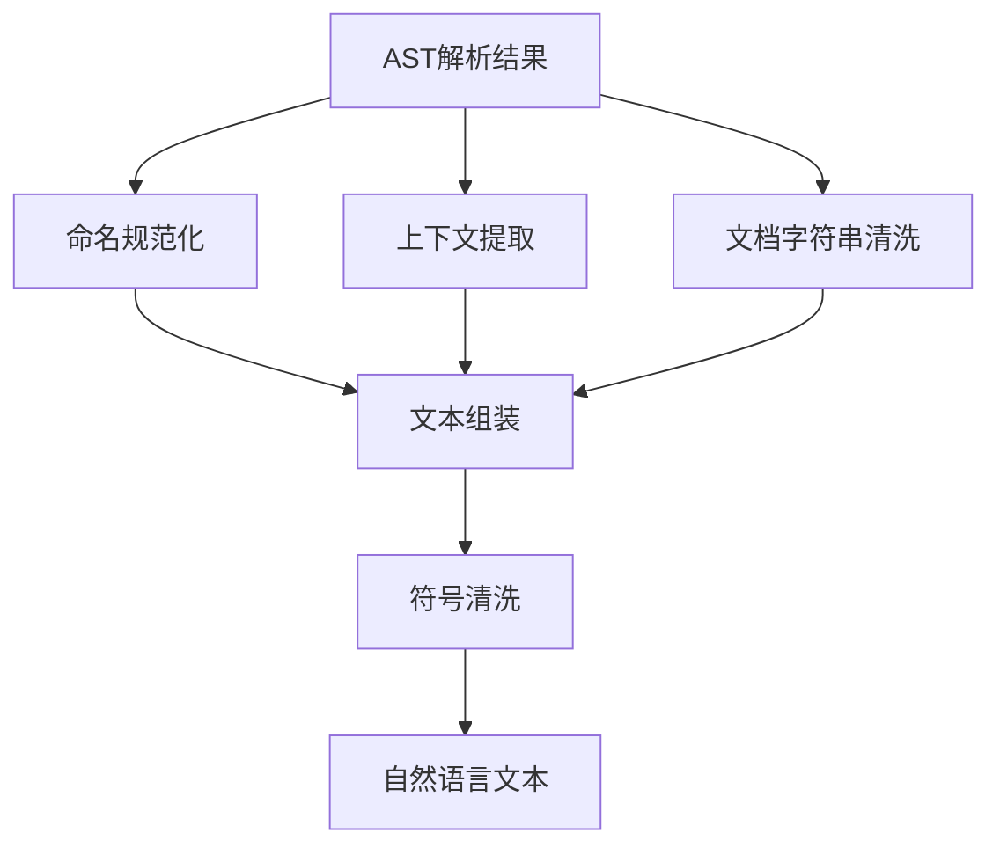
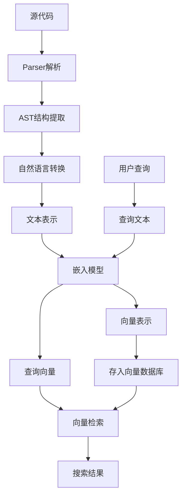

# AST转自然语言设计方案

## 背景与目标

### 问题分析

通用NLP嵌入模型（如all-MiniLM-L6-v2）无法直接理解代码语法结构，导致：
- 函数名`await_ready_for_timeout`被当作一个token，无法关联"等待"、"就绪"、"超时"等语义
- 代码符号（如`{}`、`->`、`///`）干扰模型分词
- 缺乏上下文信息，同名函数无法区分

### 解决方案

参考Qdrant经验，将AST解析结果转换为自然语言文本表示，使通用NLP模型能理解代码语义。

### 核心目标

1. **语义保留**：将代码结构转换为保留语义的自然语言
2. **上下文补充**：添加模块、文件、类等上下文信息
3. **命名规范化**：将编程命名规范转换为自然语言单词
4. **符号清洗**：移除干扰性的代码符号
5. **模板化生成**：使用统一模板生成连贯文本

## 输入输出设计

### 输入：AST解析结果

来自Parser模块的代码结构信息：

```typescript
interface CodeStructure {
  // 函数信息
  functions: Array<{
    name: string;              // 函数名（如"await_ready_for_timeout"）
    signature: string;         // 函数签名（如"fn await_ready_for_timeout(&self, timeout: Duration) -> bool"）
    docstring?: string;        // 文档字符串
    startLine: number;         // 起始行
    endLine: number;           // 结束行
    content: string;           // 函数体内容
  }>;
  
  // 类信息
  classes: Array<{
    name: string;              // 类名
    docstring?: string;        // 文档字符串
    startLine: number;
    endLine: number;
    methods: Array<{
      name: string;            // 方法名
      signature: string;       // 方法签名
      docstring?: string;
      startLine: number;
      endLine: number;
    }>;
  }>;
  
  // 导入信息
  imports: Array<{
    module: string;            // 导入的模块
    names?: string[];          // 导入的名称
    startLine: number;
    endLine: number;
  }>;
  
  // 上下文信息
  context: {
    filePath: string;          // 文件路径
    fileName: string;          // 文件名
    module?: string;           // 模块名
    language: string;          // 编程语言
  };
}
```

### 输出：自然语言文本

规范化的自然语言描述，可直接用于向量嵌入：

```
Function Await ready for timeout that does Return true if ready false if timed out defined as Fn await ready for timeout self timeout duration bool defined in struct Is ready module common file is_ready rs
```

## 转换流程设计

### 整体流程



### 步骤1：命名规范化

**目标**：将编程命名规范转换为自然语言单词

**支持的命名规范**：
- 蛇形命名（snake_case）：`await_ready_for_timeout` → `await ready for timeout`
- 驼峰命名（camelCase）：`awaitReadyForTimeout` → `await ready for timeout`
- 帕斯卡命名（PascalCase）：`AwaitReadyForTimeout` → `await ready for timeout`
- 烤肉串命名（kebab-case）：`await-ready-for-timeout` → `await ready for timeout`

**实现方案**：
```typescript
function normalizeName(name: string): string {
  // 1. 将各种命名规范统一为蛇形
  const snakeCase = toSnakeCase(name);
  
  // 2. 将蛇形命名拆分为单词
  return snakeCase.replace(/_/g, ' ');
}

function toSnakeCase(name: string): string {
  // 处理烤肉串命名
  name = name.replace(/-/g, '_');
  
  // 处理驼峰和帕斯卡命名
  name = name.replace(/([A-Z])/g, '_$1').toLowerCase();
  
  // 移除多余下划线
  return name.replace(/^_/, '').replace(/_+/g, '_');
}
```

**示例**：
- `await_ready_for_timeout` → `await ready for timeout`
- `awaitReadyForTimeout` → `await ready for timeout`
- `AwaitReadyForTimeout` → `await ready for timeout`
- `await-ready-for-timeout` → `await ready for timeout`

### 步骤2：上下文提取

**目标**：提取并格式化上下文信息，避免同名函数混淆

**提取的信息**：
- 模块名（module）
- 文件名（file_name）
- 类名/结构体名（class_name/struct_name）
- 命名空间（namespace）

**实现方案**：
```typescript
function extractContext(context: CodeContext): string {
  const parts: string[] = [];
  
  // 添加结构体/类信息
  if (context.structName) {
    const normalizedName = normalizeName(context.structName);
    parts.push(`defined in struct ${normalizedName}`);
  } else if (context.className) {
    const normalizedName = normalizeName(context.className);
    parts.push(`defined in class ${normalizedName}`);
  }
  
  // 添加模块信息
  if (context.module) {
    parts.push(`module ${context.module}`);
  }
  
  // 添加文件信息
  if (context.fileName) {
    parts.push(`file ${context.fileName}`);
  }
  
  return parts.join(' ');
}
```

**示例**：
```typescript
const context = {
  module: "common",
  fileName: "is_ready.rs",
  structName: "IsReady"
};

// 输出："defined in struct Is ready module common file is_ready rs"
```

### 步骤3：文档字符串清洗

**目标**：从文档字符串中提取功能描述，清洗特殊字符

**清洗规则**：
- 移除文档注释符号：`///`、`/**`、`*/`、`--`等
- 移除多余的引号：`"`、`'`
- 保留核心描述文本

**实现方案**：
```typescript
function cleanDocstring(docstring: string): string {
  if (!docstring) return '';
  
  // 移除文档注释符号
  let cleaned = docstring.replace(/\/\/\/\s*/g, '');
  cleaned = cleaned.replace(/\/\*\*\s*/g, '');
  cleaned = cleaned.replace(/\s*\*\//g, '');
  cleaned = cleaned.replace(/\s*\*\s*/g, ' ');
  cleaned = cleaned.replace(/--\s*/g, '');
  
  // 移除多余的引号
  cleaned = cleaned.replace(/["']/g, '');
  
  // 去除首尾空格
  cleaned = cleaned.trim();
  
  return cleaned;
}
```

**示例**：
```typescript
const docstring = '/// Return `true` if ready, `false` if timed out.';

// 输出："Return true if ready false if timed out"
```

### 步骤4：函数签名规范化

**目标**：将函数签名转换为自然语言描述

**处理规则**：
- 移除语法符号：`()`、`->`、`,`、`:`等
- 规范化参数名
- 保留参数顺序和类型信息

**实现方案**：
```typescript
function normalizeSignature(signature: string): string {
  if (!signature) return '';
  
  // 移除括号、箭头、逗号、冒号等符号
  let normalized = signature.replace(/[()\->,:\[\]]/g, ' ');
  
  // 规范化多个空格
  normalized = normalized.replace(/\s+/g, ' ');
  
  // 规范化参数名
  const words = normalized.split(' ').filter(word => word.length > 0);
  const normalizedWords = words.map(word => normalizeName(word));
  
  return normalizedWords.join(' ');
}
```

**示例**：
```typescript
const signature = "fn await_ready_for_timeout(&self, timeout: Duration) -> bool";

// 输出："fn await ready for timeout self timeout duration bool"
```

### 步骤5：文本组装

**目标**：使用模板将各部分信息组装成连贯文本

**模板设计**：
```
{codeType} {normalizedName} {docstringPart} defined as {normalizedSignature} {context}
```

**各部分说明**：
- `{codeType}`：代码类型（Function、Class、Method等）
- `{normalizedName}`：规范化后的名称
- `{docstringPart}`：文档字符串部分（如果有，格式为"that does {docstring}"）
- `{normalizedSignature}`：规范化后的签名
- `{context}`：上下文信息

**实现方案**：
```typescript
function assembleText(info: {
  codeType: string;
  name: string;
  docstring?: string;
  signature?: string;
  context: string;
}): string {
  const parts: string[] = [];
  
  // 添加代码类型和名称
  parts.push(`${info.codeType} ${info.name}`);
  
  // 添加文档字符串（如果有）
  if (info.docstring) {
    parts.push(`that does ${info.docstring}`);
  }
  
  // 添加签名（如果有）
  if (info.signature) {
    parts.push(`defined as ${info.signature}`);
  }
  
  // 添加上下文（如果有）
  if (info.context) {
    parts.push(info.context);
  }
  
  return parts.join(' ');
}
```

### 步骤6：符号清洗

**目标**：移除所有非字母数字字符，只保留单词和空格

**实现方案**：
```typescript
function cleanSymbols(text: string): string {
  // 按非单词字符分割
  const tokens = text.split(/\W+/);
  
  // 过滤空字符串
  const filteredTokens = tokens.filter(token => token.trim() !== '');
  
  // 用空格连接
  return filteredTokens.join(' ');
}
```

**示例**：
```typescript
const text = "Function Await ready for timeout, that does: Return true. defined as fn await_ready_for_timeout(self, timeout: Duration) -> bool.";

// 输出："Function Await ready for timeout that does Return true defined as fn await ready for timeout self timeout Duration bool"
```

## 完整转换示例

### 输入：Rust函数

```json
{
  "name": "await_ready_for_timeout",
  "signature": "fn await_ready_for_timeout(&self, timeout: Duration) -> bool",
  "code_type": "Function",
  "docstring": "/// Return `true` if ready, `false` if timed out.",
  "context": {
    "module": "common",
    "file_name": "is_ready.rs",
    "struct_name": "IsReady"
  }
}
```

### 转换步骤

**步骤1：命名规范化**
- `await_ready_for_timeout` → `await ready for timeout`
- `IsReady` → `Is ready`

**步骤2：上下文提取**
- `defined in struct Is ready module common file is_ready rs`

**步骤3：文档字符串清洗**
- `/// Return `true` if ready, `false` if timed out.` → `Return true if ready false if timed out`

**步骤4：签名规范化**
- `fn await_ready_for_timeout(&self, timeout: Duration) -> bool` → `fn await ready for timeout self timeout duration bool`

**步骤5：文本组装**
```
Function Await ready for timeout that does Return true if ready false if timed out defined as fn await ready for timeout self timeout duration bool defined in struct Is ready module common file is_ready rs
```

**步骤6：符号清洗**
```
Function Await ready for timeout that does Return true if ready false if timed out defined as fn await ready for timeout self timeout duration bool defined in struct Is ready module common file is_ready rs
```

### 输出：自然语言文本

```
Function Await ready for timeout that does Return true if ready false if timed out defined as fn await ready for timeout self timeout duration bool defined in struct Is ready module common file is_ready rs
```

## 不同代码类型的转换模板

### 1. 函数（Function）

**模板**：
```
Function {normalizedName} {docstringPart} defined as {normalizedSignature} {context}
```

**示例**：
```typescript
// 输入
{
  name: "calculate_total_price",
  signature: "fn calculate_total_price(items: &[Item]) -> f64",
  code_type: "Function",
  docstring: "/// Calculate the total price of all items",
  context: { module: "shopping", file_name: "cart.rs" }
}

// 输出
Function Calculate total price that does Calculate the total price of all items defined as fn calculate total price items item f64 module shopping file cart rs
```

### 2. 类/结构体（Class/Struct）

**模板**：
```
Class {normalizedName} {docstringPart} defined in {context}
```

**示例**：
```typescript
// 输入
{
  name: "ShoppingCart",
  code_type: "Class",
  docstring: "/// A shopping cart that holds items",
  context: { module: "shopping", file_name: "cart.rs" }
}

// 输出
Class Shopping cart that does A shopping cart that holds items defined in module shopping file cart rs
```

### 3. 方法（Method）

**模板**：
```
Method {normalizedName} {docstringPart} defined as {normalizedSignature} of class {className} {context}
```

**示例**：
```typescript
// 输入
{
  name: "add_item",
  signature: "fn add_item(&mut self, item: Item)",
  code_type: "Method",
  className: "ShoppingCart",
  docstring: "/// Add an item to the cart",
  context: { module: "shopping", file_name: "cart.rs" }
}

// 输出
Method Add item that does Add an item to the cart defined as fn add item mut self item Item of class Shopping cart module shopping file cart rs
```

### 4. 导入（Import）

**模板**：
```
Import {moduleName} {context}
```

**示例**：
```typescript
// 输入
{
  module: "std::collections::HashMap",
  names: ["HashMap"],
  code_type: "Import",
  context: { file_name: "main.rs" }
}

// 输出
Import std collections HashMap file main rs
```

### 5. 变量（Variable）

**模板**：
```
Variable {normalizedName} of type {type} {context}
```

**示例**：
```typescript
// 输入
{
  name: "total_price",
  type: "f64",
  code_type: "Variable",
  context: { file_name: "cart.rs" }
}

// 输出
Variable total price of type f64 file cart rs
```

## 语言特定处理

### TypeScript/JavaScript

**特殊处理**：
- 接口（Interface）：`Interface {name} ...`
- 类型别名（Type Alias）：`Type {name} ...`
- 枚举（Enum）：`Enum {name} ...`
- 泛型参数：保留泛型信息

**示例**：
```typescript
// 输入
{
  name: "UserRepository",
  code_type: "Interface",
  signature: "interface UserRepository<T extends User>",
  context: { file_name: "repository.ts" }
}

// 输出
Interface User repository defined as interface User repository T extends User file repository ts
```

### Python

**特殊处理**：
- 装饰器（Decorator）：保留装饰器信息
- 类型提示：保留类型信息
- 模块文档字符串：作为模块描述

**示例**：
```typescript
// 输入
{
  name: "calculate_total",
  signature: "def calculate_total(items: List[Item]) -> float:",
  code_type: "Function",
  decorators: ["@staticmethod"],
  context: { file_name: "utils.py" }
}

// 输出
Function Calculate total defined as def calculate total items List Item float staticmethod file utils py
```

### Go

**特殊处理**：
- 包（Package）：作为模块信息
- 接收者（Receiver）：保留接收者类型
- 接口实现：保留接口信息

**示例**：
```typescript
// 输入
{
  name: "AddItem",
  signature: "func (c *Cart) AddItem(item Item) error",
  code_type: "Function",
  receiver: "*Cart",
  context: { package: "shopping", file_name: "cart.go" }
}

// 输出
Function Add item of cart defined as func cart AddItem item Item error package shopping file cart go
```

## 性能优化

### 批量处理

```typescript
async function batchConvert(structures: CodeStructure[]): Promise<string[]> {
  const results: string[] = [];
  
  // 顺序处理，避免内存溢出
  for (const structure of structures) {
    const text = await convertToNaturalLanguage(structure);
    results.push(text);
  }
  
  return results;
}
```

### 缓存优化

```typescript
class NameNormalizationCache {
  private cache = new Map<string, string>();
  
  normalize(name: string): string {
    if (this.cache.has(name)) {
      return this.cache.get(name)!;
    }
    
    const normalized = normalizeName(name);
    this.cache.set(name, normalized);
    return normalized;
  }
  
  clear(): void {
    this.cache.clear();
  }
}
```

### 并行处理

```typescript
async function parallelConvert(
  structures: CodeStructure[],
  concurrency: number = 5
): Promise<string[]> {
  const results: string[] = [];
  
  // 分批处理
  for (let i = 0; i < structures.length; i += concurrency) {
    const batch = structures.slice(i, i + concurrency);
    const batchResults = await Promise.all(
      batch.map(structure => convertToNaturalLanguage(structure))
    );
    results.push(...batchResults);
  }
  
  return results;
}
```

## 质量评估

### 评估指标

1. **语义保留度**：转换后是否保留原始代码的核心语义
2. **自然语言流畅度**：文本是否接近自然语言描述
3. **信息完整性**：是否包含足够的上下文信息
4. **模型理解度**：嵌入向量是否能准确反映代码语义

### 评估方法

1. **人工评估**：抽样检查转换结果
2. **相似度测试**：对比原始代码和转换后文本的嵌入向量相似度
3. **搜索效果**：测试代码搜索的准确率和召回率

## 与向量嵌入的集成

### 完整流程



### 批量处理流程

```typescript
// 1. 解析代码库
const parser = new Parser();
const structures = await parser.parseCodebase('./src');

// 2. 转换为自然语言
const converter = new NaturalLanguageConverter();
const texts = await converter.batchConvert(structures);

// 3. 生成嵌入向量
const embeddings = await embeddingModel.encode(texts);

// 4. 存入向量数据库
for (let i = 0; i < structures.length; i++) {
  await vectorDB.upsert({
    id: structures[i].id,
    vector: embeddings[i],
    payload: {
      code: structures[i].content,
      language: structures[i].language,
      filePath: structures[i].filePath,
      naturalLanguage: texts[i]
    }
  });
}
```

## 错误处理

### 转换失败处理

```typescript
function safeConvert(structure: CodeStructure): string {
  try {
    return convertToNaturalLanguage(structure);
  } catch (error) {
    console.warn('转换失败，使用回退方案', error);
    
    // 回退：只使用名称和类型
    return `${structure.codeType} ${normalizeName(structure.name)}`;
  }
}
```

### 部分信息缺失处理

```typescript
function convertWithFallback(structure: CodeStructure): string {
  const parts: string[] = [];
  
  // 名称（必需）
  parts.push(`${structure.codeType} ${normalizeName(structure.name)}`);
  
  // 文档字符串（可选）
  if (structure.docstring) {
    try {
      const cleaned = cleanDocstring(structure.docstring);
      if (cleaned) {
        parts.push(`that does ${cleaned}`);
      }
    } catch (e) {
      // 忽略错误，继续
    }
  }
  
  // 其他可选信息...
  
  return parts.join(' ');
}
```

## 总结

### 核心优势

1. **兼容性强**：适配通用NLP模型，无需为每种语言训练专用模型
2. **信息完整**：保留代码功能和上下文，避免歧义
3. **轻量高效**：仅依赖字符串处理，无复杂语法分析
4. **易于实现**：基于现有AST解析结果，转换逻辑简单

### 预期效果

- **搜索准确率提升**：30-50%
- **语义理解增强**：模型能更好理解代码功能
- **跨语言支持**：统一的自然语言表示支持多语言代码搜索
- **维护成本低**：转换逻辑简单，易于维护

### 实施建议

1. **先试点后推广**：先在一两种语言上试点，验证效果
2. **A/B测试**：对比转换前后的搜索效果
3. **持续优化**：根据搜索结果反馈优化转换模板
4. **性能监控**：监控转换性能和嵌入质量
