# Relation 模块间关系

## 模块依赖图

```mermaid
graph TB
    subgraph "顶层模块"
        MOD[mod.rs]
        TYPES[types.rs]
        ERROR[error.rs]
        CONTEXT[context.rs]
    end
    
    subgraph "配置解析层"
        CONFIG[config_parser]
        DETECTOR[detector.rs]
        PARSERS[parsers/*]
    end
    
    subgraph "符号提取层"
        EXTRACT[parser/extractor]
        TRAITS[traits.rs]
        STD[common/standardized.rs]
        LANG[language-specific]
    end
    
    subgraph "符号抽象层"
        SYMBOL[symbol]
        SID[symbol/id.rs]
        SVIS[symbol/visibility.rs]
        SSCOPE[symbol/scope.rs]
        SMETA[symbol/metadata.rs]
        SINH[symbol/inheritance.rs → oop/]
    end
    
    subgraph "符号表层"
        SYMTAB[symbol_table]
        LOCAL[local.rs]
        MODULE[module.rs]
        PACKAGE[package.rs]
        PROJECT[project.rs]
    end
    
    subgraph "索引层"
        IDX[index]
        CORE[core.rs]
        RESOLVER[resolver.rs]
        LOCAL_RES[local_call_resolver.rs]
        DEPEND_IDX[dependency_index.rs]
        ENTITY_IDX[entity_index.rs]
        QUERY_IDX[relation_query.rs]
        FILE_IDX[file_index.rs]
        REVERSE_IDX[reverse_index.rs]
    end
    
    subgraph "查询层"
        QUERY[query.rs]
        TRAVERSAL[CallChainTraverser]
        TRAVCFG[TraversalConfig]
    end
    
    subgraph "依赖图层"
        DEP[dependency_graph.rs]
    end
    
    MOD --> CONFIG
    MOD --> EXTRACT
    MOD --> SYMBOL
    MOD --> SYMTAB
    MOD --> IDX
    MOD --> QUERY
    MOD --> DEP
    
    CONFIG --> DETECTOR
    DETECTOR --> PARSERS
    
    EXTRACT --> TRAITS
    TRAITS --> STD
    TRAITS --> LANG
    
    SYMBOL --> SID
    SYMBOL --> SVIS
    SYMBOL --> SSCOPE
    SYMBOL --> SMETA
    SYMBOL --> SINH
    
    SYMTAB --> LOCAL
    SYMTAB --> MODULE
    SYMTAB --> PACKAGE
    SYMTAB --> PROJECT
    SYMTAB --> SFC
    
    MG --> MGTYPE
    MG --> MGB
    MG --> MGR
    MG --> MGQ
    
    IDX --> CORE
    IDX --> RESOLVER
    IDX --> LOCAL_RES
    IDX --> DEPEND_IDX
    
    QUERY --> TRAVERSAL
    QUERY --> TRAVCFG
    
    ERROR --> TYPES
    CONTEXT --> ERROR
```



## 数据流

### 1. 索引构建流程

```
源代码
  ↓
[Parser] 解析为 AST
  ↓
[Extraction] 提取导入/导出
  ├─> StandardizedImport/Export
  └─> 依赖 config_parser 的包信息
  ↓
[LocalSymbolTable] 构建文件级符号表
  └─> 使用 symbol::SymbolId
  ↓
[ModuleSymbolTable] 构建模块级符号表
  └─> 使用 parser/extractor 的导入/导出
  ↓
[PackageSymbolTable] 构建包级符号表
  └─> 聚合模块导出
  ↓
[ProjectSymbolTable] 构建项目级符号表
  └─> 聚合所有包和外部依赖
  ↓
[LocalCallResolver] 解析文件内调用
  └─> 使用 LocalSymbolTable
  ↓
[RelationResolver] 解析跨文件调用
  ├─> 使用 ProjectSymbolTable
  ├─> 使用 config_parser 的依赖信息
  └─> 分类外部调用
  ↓
[IndexBuilder] 构建索引
  ├─> 添加函数到 function_index
  ├─> 添加关系到 resolved_relation_index
  └─> 构建 callee_index（反向索引）
  ↓
RelationIndex（完成）
```

### 2. 符号解析流程

```
调用名（callee_name）
  ↓
[RelationResolver::resolve]
  ↓
1. 检查标准库（StdlibDetector）
  ├─> 是标准库 → 分类为 ExternalCallType::StandardLibrary
  └─> 否 → 继续
  ↓
2. 尝试完全限定名解析
  ├─> qualified_name = "file_path::callee_name"
  └─> ProjectSymbolTable::get_by_qualified_name
  ↓
3. 回退到简单名解析
  ├─> ProjectSymbolTable::get_by_simple_name
  └─> 搜索所有包
  ↓
4. 回退到局部符号
  └─> parsed.local_symbols
  ↓
5. 如果未找到 → 分类为外部调用
  ├─> 使用 DependencyIndex 查找匹配依赖
  └─> 分类为 ExternalCallType::ExternalLibrary/Unknown
  ↓
ResolvedRelation（完成）
```

### 3. 查询流程

```
查询请求（EntityId）
  ↓
[CallChainQuery]
  ↓
1. 验证 EntityId 存在
  └─> RelationIndex::contains_function
  ↓
2. 根据查询类型选择策略
  ├─> 正向调用链 → CallChainTraverser::traverse_from(Forward)
  ├─> 反向调用链 → CallChainTraverser::traverse_from(Backward)
  └─> 查找路径 → CallChainTraverser::find_path
  ↓
3. 遍历调用图
  ├─> 使用 callee_index 快速反向查找
  ├─> 使用 resolved_relation_index 正向查找
  └─> 检测并处理循环
  ↓
4. 收集结果
  └─> CallChainNode 列表
  ↓
查询结果（完成）
```

## 模块间依赖关系

### 底层依赖（被依赖）

| 模块 | 被哪些模块依赖 |
|------|---------------|
| `symbol/` | symbol_table/, index/ |
| `parser/extractor/` | index/ |
| `types.rs` | 所有模块 |
| `error.rs` | 所有模块 |
| `config_parser/` | index/resolver.rs |

### 中层依赖

| 模块 | 依赖 |
|------|------|
| `symbol_table/` | symbol/, parser/extractor/ |
| `index/local_call_resolver.rs` | types/ |

### 高层依赖（依赖其他模块）

| 模块 | 依赖 |
|------|------|
| `index/resolver.rs` | symbol_table/, config_parser/, parser/extractor/ |
| `index/core.rs` | symbol_table/, dependency_graph/ |
| `query.rs` | index/, symbol_table/ |

### 独立模块

| 模块 | 说明 |
|------|------|
| `dependency_graph.rs` | 相对独立，仅依赖基础类型 |
| `types.rs` | 被依赖，不依赖其他模块 |
| `error.rs` | 被依赖，仅依赖基础类型 |

## 关键交互场景

### 场景 1：热更新

```
文件 A 修改
  ↓
[DependencyGraph] 检测变化
  ↓
1. 收集受影响的文件
  └─> collect_transitive_dependents(A)
  ↓
2. 拓扑排序
  └─> topological_sort(affected_files)
  ↓
3. 按顺序重新解析
  ├─> 重新 parser/extractor
  ├─> 重新 symbol_table
  └─> 重新 index
  ↓
索引更新完成
```

### 场景 2：跨文件符号解析

```
文件 A 调用 文件 B 的函数
  ↓
[LocalCallResolver] 解析文件 A
  ├─> 发现跨文件调用
  └─> 跳过（不解析）
  ↓
[RelationResolver] 解析跨文件
  ├─> 查询 ProjectSymbolTable
  │   ├─> 查找 qualified_name
  │   └─> 查找 simple_name
  ├─> 使用 IndexBuilder 解析导入关系
  └─> 找到文件 B 的符号
  ↓
创建 ResolvedRelation
```

### 场景 3：可见性检查

```
文件 A 访问 文件 B 的符号
  ↓
[Visibility::is_visible_from]
  ├─> 获取 from_scope（文件 A 的作用域）
  ├─> 获取 defined_in（文件 B 的作用域）
  └─> 根据语言应用规则
      ├─> Rust: 检查 crate/module 路径
      ├─> Java: 检查 package/继承
      └─> C++: 检查 friend/继承
  ↓
返回可见性结果
```

### 场景 4：外部调用分类

```
调用未知符号
  ↓
[RelationResolver::resolve]
  ├─> 未找到符号 → is_external = true
  ├─> 检查是否标准库
  │   └─> StdlibDetector::is_stdlib_by_type
  ├─> 检查是否外部包
  │   └─> DependencyIndex::find_dependency
  └─> 分类结果：
      ├─> ExternalCallType::StandardLibrary
      ├─> ExternalCallType::ExternalLibrary
      ├─> ExternalCallType::DevDependency
      ├─> ExternalCallType::LocalDependency
      └─> ExternalCallType::Unknown
```

## 内存共享策略

### Arc 使用

| 数据结构 | 共享方式 | 目的 |
|---------|---------|------|
| `LocalSymbolTable::entities` | Arc<HashMap> | 与 ParsedFile 共享 |
| `LocalSymbolTable::file_path` | Arc<str> | 减少字符串复制 |
| `LocalSymbolTable::name_index` | HashMap<Arc<str>, ...> | 键共享 |
| `ProjectSymbolTable::symbol_id_counter` | Arc<AtomicU64> | 全局计数器共享 |
| `RelationIndex::dependency_graph` | Arc<FileDependencyGraph> | 线程安全共享 |

### 避免复制

1. **Entity 数据** - 使用 Arc 共享，避免在 LocalSymbolTable 和 ParsedFile 间复制
2. **SymbolId** - 使用全局计数器，避免多表间 ID 冲突
3. **DashMap** - 所有索引使用 DashMap，内部线程安全，避免外部锁

## 性能优化点

### 1. 反向索引（callee_index）

**问题**：查找谁调用了函数需要遍历所有调用关系

**解决**：
```rust
// 添加关系时同时构建反向索引
pub fn add_resolved_relation(&self, relation: ResolvedRelation) {
    // 正向索引
    self.resolved_relation_index
        .entry(relation.caller)
        .or_default()
        .push(relation.clone());
    
    // 反向索引（O(1) 查找）
    if let Some(callee_id) = relation.callee_id {
        self.callee_index
            .entry(callee_id)
            .or_default()
            .push(relation.caller);
    }
}
```

### 2. 依赖索引（DependencyIndex）

**问题**：分类外部调用时需要查找匹配依赖

**解决**：
```rust
// 构建索引
pub fn build(dependencies: &HashMap<Language, Vec<Dependency>>) -> Self {
    for (lang, deps) in dependencies {
        for dep in deps {
            // 按包名建立索引
            self.index
                .entry(*lang)
                .or_default()
                .insert(dep.name.clone(), dep.clone());
        }
    }
}

// O(1) 查找
pub fn find_dependency(&self, lang, name) -> Option<Dependency> {
    self.index.get(lang)?.get(name).cloned()
}
```

### 3. 符号解析缓存

**问题**：重复解析相同符号

**解决**：
```rust
// ProjectSymbolTable 中的缓存
resolution_cache: DashMap<String, Option<SymbolRef>>;

pub fn resolve_qualified(&self, qualified_name: &str) -> Option<SymbolRef> {
    // 先查缓存
    if let Some(result) = self.resolution_cache.get(qualified_name) {
        return result.clone();
    }
    
    // 解析并缓存
    let result = self.resolve_qualified_internal(qualified_name);
    self.resolution_cache.insert(qualified_name.to_string(), result.clone());
    result
}
```

## 线程安全

### 无锁设计

所有核心数据结构使用 `DashMap`，提供细粒度锁：

```rust
pub struct RelationIndex {
    function_index: DashMap<EntityId, Entity>,           // 细粒度锁
    resolved_relation_index: DashMap<EntityId, Vec<...>>, // 细粒度锁
    callee_index: DashMap<EntityId, Vec<EntityId>>,      // 细粒度锁
    // ...
}
```

### 原子操作

```rust
// 全局计数器
symbol_id_counter: Arc<AtomicU64>  // 原子递增

// 版本控制
version_counter: AtomicU64  // FileDependencyGraph 中的版本

// 计数统计
filtered_count: AtomicUsize  // RelationResolver 中的过滤计数
```

## 总结

Relation 模块的模块间关系呈现清晰的层次结构：

1. **底层**：symbol/, parser/extractor/, types, error - 基础抽象
2. **中层**：symbol_table/ - 组织和管理
3. **高层**：index/, query/ - 核心功能和用户接口

数据流遵循从提取→解析→索引→查询的流水线，各模块通过明确的接口交互，使用 Arc 和 DashMap 实现高效的内存共享和线程安全。
