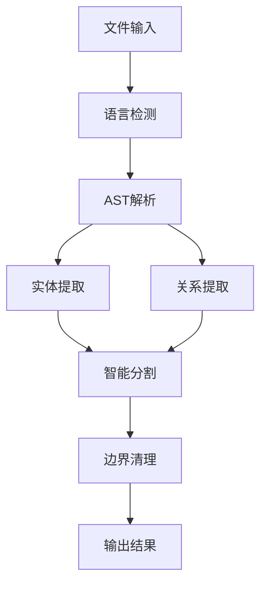
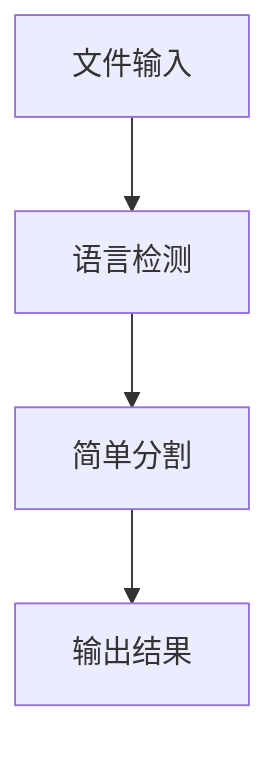
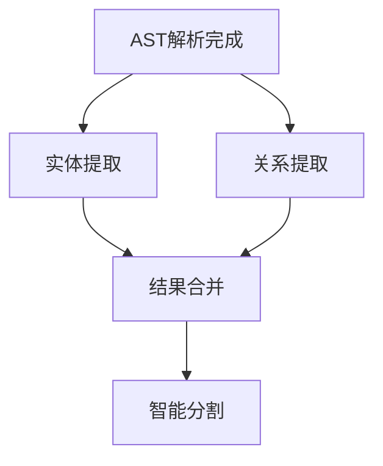

# Parser模块优化工作流设计

## 设计目标

1. **简化架构**：减少50-60%的代码量和文件数量
2. **清晰职责**：明确各模块的职责边界
3. **提高性能**：优化处理流程，减少不必要的步骤
4. **降低维护成本**：简化逻辑，提高可维护性
5. **保持核心功能**：确保核心功能不受影响

## 优化原则

1. **KISS原则**：保持简单，避免过度设计
2. **单一职责**：每个模块只负责一个明确的职责
3. **按需设计**：只实现实际需要的功能
4. **性能优先**：在保证功能的前提下优化性能
5. **可扩展性**：保持架构的扩展能力

## 优化后的架构设计

### 模块结构

```
src/service/parser/
├── ParserService.ts                      # 统一解析服务入口（简化）
├── index.ts                              # 模块导出
├── detection/                            # 语言检测模块（简化）
│   └── LanguageDetector.ts               # 核心语言检测服务
├── query/                                # 查询系统（简化）
│   ├── QueryExecutor.ts                  # 查询执行引擎（拆分）
│   ├── QueryManager.ts                   # 查询管理器
│   ├── DynamicParserManager.ts           # 动态解析器管理
│   ├── types/                            # 类型定义
│   └── queries-constant/                 # 查询常量（保留）
├── processing/                           # 处理系统（简化）
│   ├── coordinator/
│   │   └── ProcessingCoordinator.ts      # 处理协调器（简化）
│   ├── strategies/                       # 分割策略（简化）
│   │   ├── ASTCodeSplitter.ts          # AST分割器（优化）
│   │   └── SimpleTextSplitter.ts       # 简单文本分割器（新增）
│   ├── StrategyFactory.ts                # 策略工厂（简化）
│   └── types/                            # 核心类型定义
├── structure/                            # 代码结构服务（保留）
│   └── CodeStructureService.ts           # 代码结构提取
└── constants/                            # 常量配置（简化）
    ├── language-constants.ts             # 语言常量
    └── language-classification.ts        # 语言分类
```

### 核心模块优化

#### 1. ParserService（简化版）

**职责**：统一解析服务入口，协调各模块

**优化点**：
- 移除复杂的初始化逻辑
- 简化错误处理
- 统一缓存管理
- 减少依赖

**核心流程**：
```typescript
class ParserService {
  async parseFile(filePath: string, content: string): Promise<ParseResult> {
    // 1. 语言检测
    const language = await this.detectLanguage(filePath, content);
    
    // 2. AST解析（代码文件）
    if (this.isCodeFile(language)) {
      const ast = await this.parseAST(content, language);
      const structure = await this.extractStructure(ast, language);
      return { ast, language, structure, success: true };
    }
    
    // 3. 文本处理（文本文件）
    const chunks = await this.splitText(content, language);
    return { chunks, language, success: true };
  }
}
```

#### 2. QueryExecutor（拆分版）

**职责**：执行查询，拆分为多个小文件

**拆分方案**：
```
query/
├── QueryExecutor.ts              # 主执行器（200行）
├── EntityQueryExecutor.ts        # 实体查询（150行）
├── RelationshipQueryExecutor.ts  # 关系查询（150行）
├── QueryCacheManager.ts          # 缓存管理（100行）
└── QueryResultProcessor.ts       # 结果处理（100行）
```

**优化点**：
- 按功能拆分，每个文件职责单一
- 简化缓存管理，统一缓存层
- 移除复杂的回退机制
- 简化初始化流程

#### 3. ProcessingCoordinator（简化版）

**职责**：协调处理流程，简化策略选择

**优化点**：
- 策略选择逻辑简化
- 移除复杂的优先级系统
- 减少配置选项
- 简化错误处理

**核心逻辑**：
```typescript
class ProcessingCoordinator {
  async process(content: string, language: string): Promise<CodeChunk[]> {
    // 1. 选择策略
    const strategy = this.selectStrategy(language);
    
    // 2. 执行分割
    const chunks = await strategy.split(content, language);
    
    // 3. 简单后处理（边界清理）
    return this.cleanupBoundaries(chunks);
  }
  
  private selectStrategy(language: string): ISplitStrategy {
    if (this.isCodeLanguage(language)) {
      return this.astSplitter;  // AST分割
    }
    return this.textSplitter;   // 文本分割
  }
}
```

#### 4. 分割策略（简化版）

**保留策略**：
1. **ASTCodeSplitter**：用于代码文件
   - 基于Tree-sitter AST
   - 智能识别代码结构
   - 保证语法完整性

2. **SimpleTextSplitter**：用于文本文件（新增）
   - 基于行的简单分割
   - 支持基本的文本结构
   - 轻量级实现

**移除策略**：
- MarkdownSegmentationStrategy → 用SimpleTextSplitter替代
- XMLSegmentationStrategy → 用SimpleTextSplitter替代
- LineSegmentationStrategy → 合并到SimpleTextSplitter
- UniversalTextStrategy → 合并到SimpleTextSplitter
- BracketSegmentationStrategy → 功能由ASTCodeSplitter覆盖

## 优化后的工作流

### 代码文件处理流程



**流程说明**：
1. **语言检测**：识别文件类型和编程语言
2. **AST解析**：使用Tree-sitter解析代码
3. **实体提取**：并行提取函数、类、变量等实体
4. **关系提取**：并行提取调用、依赖等关系
5. **智能分割**：基于AST结构进行智能分割
6. **边界清理**：简单的边界优化
7. **输出结果**：返回分割后的代码块

### 文本文件处理流程



**流程说明**：
1. **语言检测**：识别文件类型
2. **简单分割**：基于行的简单分割
3. **输出结果**：返回分割后的文本块

### 并行处理设计



**并行策略**：
- 实体提取和关系提取并行执行
- 不同查询类型并行执行
- 缓存预热异步进行

## 缓存优化设计

### 统一缓存层

```typescript
interface UnifiedCache {
  // AST缓存
  setAST(key: string, ast: AST): Promise<void>;
  getAST(key: string): Promise<AST | null>;
  
  // 查询结果缓存
  setQueryResult(key: string, result: QueryResult): Promise<void>;
  getQueryResult(key: string): Promise<QueryResult | null>;
  
  // 代码块缓存
  setChunks(key: string, chunks: CodeChunk[]): Promise<void>;
  getChunks(key: string): Promise<CodeChunk[] | null>;
}
```

**优化点**：
- 统一缓存接口，减少缓存层次
- 简化缓存键生成
- 统一缓存清理策略
- 减少内存占用

### 缓存策略

1. **AST缓存**：缓存解析后的AST
   - 键：`ast:${contentHash}:${language}`
   - TTL：10分钟
   - 大小限制：1000个

2. **查询结果缓存**：缓存查询结果
   - 键：`query:${astHash}:${queryType}:${language}`
   - TTL：5分钟
   - 大小限制：5000个

3. **代码块缓存**：缓存分割结果
   - 键：`chunks:${contentHash}:${strategy}`
   - TTL：2分钟
   - 大小限制：2000个

## 错误处理设计

### 简化错误处理

```typescript
class ErrorHandler {
  async handle<T>(operation: () => Promise<T>, fallback: T): Promise<T> {
    try {
      return await operation();
    } catch (error) {
      this.logger.warn('Operation failed, using fallback', error);
      return fallback;
    }
  }
}
```

**优化点**：
- 单层错误处理，避免嵌套
- 简单的回退机制
- 统一的错误日志
- 避免过度保护

### 回退策略

1. **AST解析失败**：回退到文本分割
2. **查询失败**：返回空结果，不阻塞流程
3. **分割失败**：回退到行分割
4. **缓存失败**：直接执行，不依赖缓存

## 配置简化设计

### 统一配置

```typescript
interface ParserConfig {
  // 解析配置
  parsing: {
    maxFileSize: number;        // 最大文件大小
    timeout: number;            // 超时时间
  };
  
  // 查询配置
  query: {
    enableCache: boolean;       // 启用查询缓存
    maxCacheSize: number;       // 最大缓存大小
  };
  
  // 分割配置
  splitting: {
    strategy: 'ast' | 'simple'; // 分割策略
    chunkSize: number;          // 代码块大小
    overlap: number;            // 重叠大小
  };
  
  // 性能配置
  performance: {
    enableParallel: boolean;    // 启用并行处理
    maxConcurrency: number;     // 最大并发数
  };
}
```

**优化点**：
- 统一配置接口
- 减少配置选项（从50+个减少到10-15个）
- 合理的默认值
- 支持环境变量覆盖

## 性能优化设计

### 并行处理

```typescript
class ParallelProcessor {
  async processInParallel<T>(
    items: T[],
    processor: (item: T) => Promise<any>,
    options: { concurrency?: number } = {}
  ): Promise<any[]> {
    const concurrency = options.concurrency || this.getDefaultConcurrency();
    const results: any[] = [];
    
    // 分批处理
    for (let i = 0; i < items.length; i += concurrency) {
      const batch = items.slice(i, i + concurrency);
      const batchResults = await Promise.all(
        batch.map(item => processor(item))
      );
      results.push(...batchResults);
    }
    
    return results;
  }
}
```

**优化点**：
- 并行执行独立任务
- 控制并发数，避免资源耗尽
- 支持分批处理大量数据
- 错误隔离，单任务失败不影响其他任务

### 性能监控

```typescript
interface PerformanceMetrics {
  // 解析性能
  parseTime: number;          // 解析时间
  astSize: number;            // AST大小
  
  // 查询性能
  queryTime: number;          // 查询时间
  entityCount: number;        // 实体数量
  relationshipCount: number;  // 关系数量
  
  // 分割性能
  splitTime: number;          // 分割时间
  chunkCount: number;         // 代码块数量
  
  // 缓存性能
  cacheHitRate: number;       // 缓存命中率
}
```

**优化点**：
- 轻量级性能监控
- 关键指标收集
- 支持性能分析
- 不影响主流程性能

## 测试策略

### 测试金字塔

```
测试层级：
├── 单元测试（60%）
│   ├── 策略测试
│   ├── 查询测试
│   └── 工具类测试
├── 集成测试（30%）
│   ├── 工作流测试
│   ├── 模块集成测试
│   └── 性能测试
└── 端到端测试（10%）
    ├── 完整流程测试
    └── 边界场景测试
```

**优化点**：
- 增加单元测试覆盖率
- 减少集成测试数量
- 关键路径端到端测试
- 性能基准测试

### 测试数据

```typescript
const testCases = [
  {
    name: 'TypeScript代码文件',
    file: 'test.ts',
    content: `
      import { foo } from './bar';
      
      class MyClass {
        method() {
          return foo();
        }
      }
    `,
    expected: {
      language: 'typescript',
      entities: ['import', 'class', 'method'],
      chunks: 3
    }
  },
  {
    name: 'Markdown文本文件',
    file: 'README.md',
    content: `
      # Title
      
      ## Section 1
      Content 1
      
      ## Section 2
      Content 2
    `,
    expected: {
      language: 'markdown',
      chunks: 3
    }
  }
];
```

## 迁移策略

### 阶段一：准备阶段（1周）

1. **代码分析**：全面分析现有代码依赖
2. **测试覆盖**：确保现有功能有充分测试
3. **文档准备**：准备迁移文档和指南
4. **环境准备**：准备测试环境和数据

### 阶段二：核心重构（2周）

1. **QueryExecutor拆分**：按功能拆分为多个小文件
2. **策略系统简化**：移除冗余策略，保留核心策略
3. **后处理系统移除**：移除大部分后处理器
4. **缓存系统统一**：统一缓存管理

### 阶段三：集成测试（1周）

1. **单元测试**：确保每个模块功能正确
2. **集成测试**：确保模块间协作正常
3. **性能测试**：确保性能满足要求
4. **回归测试**：确保现有功能不受影响

### 阶段四：上线部署（1周）

1. **灰度发布**：先在小范围部署
2. **监控指标**：监控关键性能指标
3. **问题修复**：及时修复发现的问题
4. **全面上线**：确认稳定后全面上线

## 风险评估

### 高风险

1. **功能损失**：移除某些模块可能导致功能损失
   - **缓解**：充分评估每个模块的价值
   - **应对**：保留核心功能，移除边缘功能

2. **性能下降**：简化后可能在某些场景下性能下降
   - **缓解**：进行充分的性能测试
   - **应对**：优化关键路径，保持性能

### 中风险

1. **兼容性问题**：接口变更可能导致兼容性问题
   - **缓解**：保持核心接口稳定
   - **应对**：提供适配层，逐步迁移

2. **测试不足**：测试覆盖不足可能导致问题
   - **缓解**：增加测试覆盖率
   - **应对**：关键路径全覆盖测试

### 低风险

1. **学习成本**：团队需要学习新的架构
   - **缓解**：提供文档和培训
   - **应对**：逐步迁移，降低学习成本

2. **维护成本**：初期维护成本可能增加
   - **缓解**：充分文档化
   - **应对**：建立维护指南

## 成功标准

### 技术指标

1. **代码量**：减少50-60%
2. **文件数量**：减少50-60%
3. **测试覆盖率**：保持或提高
4. **性能**：保持或提升
5. **Bug数量**：不增加

### 业务指标

1. **功能完整性**：核心功能不受影响
2. **用户体验**：无明显变化
3. **维护效率**：提升50%+
4. **开发效率**：提升30%+

## 总结

通过本次优化，我们将：

1. **简化架构**：从过度设计到简洁实用
2. **清晰职责**：每个模块职责明确
3. **提高性能**：优化处理流程
4. **降低成本**：减少维护成本
5. **保持功能**：核心功能不受影响

优化后的架构将更加易于理解、维护和扩展，为未来的功能开发奠定良好基础。