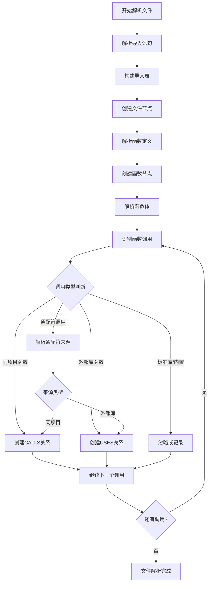

# 函数调用分类与导入处理

## 概述

本文档详细分析如何区分不同类型的函数调用，以及如何处理导入语句以正确构建图数据库中的实体关系。

## 核心问题

1. **函数调用分类**：如何区分依赖库函数调用、同项目文件函数调用
2. **外部库实体化**：是否应该把外部库也视为单独的实体
3. **导入语句处理**：如何解析导入语句以正确创建文件实体
4. **通配符导入**：如何处理 `import * from module` 的形式

## 函数调用分类

### 调用类型定义

| 调用类型 | 定义 | 示例 | 是否创建节点 |
|---------|------|------|-------------|
| **同项目函数调用** | 调用同一项目内的函数 | `calculateTotal()` | 是 |
| **标准库函数调用** | 调用语言标准库函数 | `Math.max()`, `len()` | 否（或简化） |
| **第三方库函数调用** | 调用外部依赖库函数 | `lodash.map()`, `axios.get()` | 是（库级别） |
| **内置函数调用** | 调用语言内置函数 | `console.log()`, `print()` | 否 |
| **方法调用** | 调用对象的方法 | `user.getName()` | 取决于对象来源 |

### 分类策略

#### 策略1：基于导入表分类

```typescript
// 步骤1：解析导入语句，构建导入表
interface ImportTable {
  // 标准导入
  namedImports: Map<string, ImportInfo>;  // { 'map': { source: 'lodash', type: 'external' } }
  
  // 默认导入
  defaultImports: Map<string, ImportInfo>;  // { 'axios': { source: 'axios', type: 'external' } }
  
  // 通配符导入
  wildcardImports: Map<string, ImportInfo>;  // { '*': { source: 'utils', type: 'internal' } }
  
  // 同项目导入
  internalImports: Map<string, ImportInfo>;  // { './user': { source: './user', type: 'internal' } }
}

interface ImportInfo {
  source: string;      // 导入源路径或包名
  type: 'internal' | 'external' | 'standard';
  isWildcard: boolean;
}

// 步骤2：根据导入表分类函数调用
function classifyFunctionCall(
  functionName: string,
  importTable: ImportTable
): CallType {
  // 检查命名导入
  if (importTable.namedImports.has(functionName)) {
    const importInfo = importTable.namedImports.get(functionName)!;
    return importInfo.type === 'internal' ? 'internal' : 'external';
  }
  
  // 检查默认导入
  if (importTable.defaultImports.has(functionName)) {
    const importInfo = importTable.defaultImports.get(functionName)!;
    return importInfo.type === 'internal' ? 'internal' : 'external';
  }
  
  // 检查通配符导入
  if (importTable.wildcardImports.size > 0) {
    // 需要进一步解析确定来源
    return 'wildcard';
  }
  
  // 检查标准库
  if (isStandardLibraryFunction(functionName)) {
    return 'standard';
  }
  
  // 检查内置函数
  if (isBuiltinFunction(functionName)) {
    return 'builtin';
  }
  
  // 默认为同项目函数
  return 'internal';
}
```

#### 策略2：基于路径解析分类

```typescript
function classifyByPath(callExpression: CallExpression, projectRoot: string): CallType {
  const callee = callExpression.callee;
  
  // 情况1：成员表达式（如 user.getName()）
  if (callee.type === 'MemberExpression') {
    const object = callee.object;
    
    // 检查对象是否来自导入
    if (object.type === 'Identifier') {
      const importInfo = importTable.get(object.name);
      if (importInfo) {
        return importInfo.type === 'internal' ? 'internal' : 'external';
      }
    }
    
    // 检查是否是标准库对象
    if (isStandardLibraryObject(object.name)) {
      return 'standard';
    }
  }
  
  // 情况2：简单标识符（如 calculateTotal()）
  if (callee.type === 'Identifier') {
    return classifyFunctionCall(callee.name, importTable);
  }
  
  return 'unknown';
}
```

## 图数据库节点设计

### 节点类型

```typescript
// 1. 文件节点
interface FileNode {
  id: string;              // 文件唯一ID
  path: string;            // 文件路径
  language: string;        // 编程语言
  type: 'file';
}

// 2. 函数节点
interface FunctionNode {
  id: string;              // 函数唯一ID
  name: string;            // 函数名
  signature: string;       // 函数签名
  fileId: string;          // 所属文件ID
  type: 'function';
}

// 3. 库节点（外部依赖）
interface LibraryNode {
  id: string;              // 库唯一ID
  name: string;            // 库名称
  version?: string;        // 版本号（从package.json读取）
  type: 'library';
}

// 4. 模块节点（同项目模块）
interface ModuleNode {
  id: string;              // 模块唯一ID
  path: string;            // 模块路径
  type: 'module';
}
```

### 关系类型

```typescript
// 1. 函数调用关系
interface CallsRelation {
  source: string;          // 调用者函数ID
  target: string;          // 被调用者函数ID
  type: 'CALLS';
  properties: {
    callCount: number;
    callLocations: string[];
  };
}

// 2. 文件导入关系
interface ImportsRelation {
  source: string;          // 源文件ID
  target: string;          // 目标文件/库ID
  type: 'IMPORTS';
  properties: {
    importType: 'named' | 'default' | 'wildcard';
    importedNames?: string[];
  };
}

// 3. 函数所属关系
interface BelongsToRelation {
  source: string;          // 函数ID
  target: string;          // 文件ID
  type: 'BELONGS_TO';
}

// 4. 库使用关系
interface UsesRelation {
  source: string;          // 函数ID
  target: string;          // 库ID
  type: 'USES';
  properties: {
    functionName: string;
  };
}
```

## 导入语句AST解析

### 导入语句类型

#### 1. 命名导入（Named Import）

```typescript
// 输入代码
import { map, filter, reduce } from 'lodash';
import { User, Product } from './models';

// AST解析结果
interface NamedImport {
  type: 'named';
  source: string;          // 'lodash' 或 './models'
  names: string[];         // ['map', 'filter', 'reduce'] 或 ['User', 'Product']
  isExternal: boolean;     // true for 'lodash', false for './models'
}

// 处理逻辑
function processNamedImport(importNode: NamedImport, importTable: ImportTable): void {
  const isExternal = !importNode.source.startsWith('./') && !importNode.source.startsWith('../');
  
  for (const name of importNode.names) {
    importTable.namedImports.set(name, {
      source: importNode.source,
      type: isExternal ? 'external' : 'internal',
      isWildcard: false
    });
  }
  
  // 创建导入关系
  if (isExternal) {
    // 创建或获取库节点
    const libraryId = getOrCreateLibraryNode(importNode.source);
    createImportRelation(currentFileId, libraryId, 'named', importNode.names);
  } else {
    // 创建或获取文件节点
    const targetFileId = resolveFilePath(importNode.source);
    createImportRelation(currentFileId, targetFileId, 'named', importNode.names);
  }
}
```

#### 2. 默认导入（Default Import）

```typescript
// 输入代码
import axios from 'axios';
import UserService from './services/user';

// AST解析结果
interface DefaultImport {
  type: 'default';
  source: string;          // 'axios' 或 './services/user'
  localName: string;       // 'axios' 或 'UserService'
  isExternal: boolean;
}

// 处理逻辑
function processDefaultImport(importNode: DefaultImport, importTable: ImportTable): void {
  const isExternal = !importNode.source.startsWith('./') && !importNode.source.startsWith('../');
  
  importTable.defaultImports.set(importNode.localName, {
    source: importNode.source,
    type: isExternal ? 'external' : 'internal',
    isWildcard: false
  });
  
  // 创建导入关系
  if (isExternal) {
    const libraryId = getOrCreateLibraryNode(importNode.source);
    createImportRelation(currentFileId, libraryId, 'default', [importNode.localName]);
  } else {
    const targetFileId = resolveFilePath(importNode.source);
    createImportRelation(currentFileId, targetFileId, 'default', [importNode.localName]);
  }
}
```

#### 3. 通配符导入（Wildcard Import）

```typescript
// 输入代码
import * as utils from './utils';
import * as React from 'react';

// AST解析结果
interface WildcardImport {
  type: 'wildcard';
  source: string;          // './utils' 或 'react'
  localName: string;       // 'utils' 或 'React'
  isExternal: boolean;
}

// 处理逻辑
function processWildcardImport(importNode: WildcardImport, importTable: ImportTable): void {
  const isExternal = !importNode.source.startsWith('./') && !importNode.source.startsWith('../');
  
  importTable.wildcardImports.set(importNode.localName, {
    source: importNode.source,
    type: isExternal ? 'external' : 'internal',
    isWildcard: true
  });
  
  // 创建导入关系
  if (isExternal) {
    const libraryId = getOrCreateLibraryNode(importNode.source);
    createImportRelation(currentFileId, libraryId, 'wildcard', [importNode.localName]);
  } else {
    const targetFileId = resolveFilePath(importNode.source);
    createImportRelation(currentFileId, targetFileId, 'wildcard', [importNode.localName]);
  }
}
```

#### 4. 副作用导入（Side-effect Import）

```typescript
// 输入代码
import './styles.css';
import 'reflect-metadata';

// AST解析结果
interface SideEffectImport {
  type: 'side-effect';
  source: string;
  isExternal: boolean;
}

// 处理逻辑
function processSideEffectImport(importNode: SideEffectImport): void {
  const isExternal = !importNode.source.startsWith('./') && !importNode.source.startsWith('../');
  
  // 创建导入关系（不添加到导入表）
  if (isExternal) {
    const libraryId = getOrCreateLibraryNode(importNode.source);
    createImportRelation(currentFileId, libraryId, 'side-effect', []);
  } else {
    const targetFileId = resolveFilePath(importNode.source);
    createImportRelation(currentFileId, targetFileId, 'side-effect', []);
  }
}
```

## 通配符导入的特殊处理

### 问题分析

通配符导入（`import * as utils from './utils'`）带来的挑战：

1. **调用来源不确定**：无法直接从导入表确定函数调用来源
2. **需要动态解析**：需要在调用时解析函数的实际来源
3. **性能影响**：每次调用都需要查询

### 解决方案

#### 方案1：延迟解析（推荐）

```typescript
// 步骤1：记录通配符导入
importTable.wildcardImports.set('utils', {
  source: './utils',
  type: 'internal',
  isWildcard: true
});

// 步骤2：在遇到调用时解析
function resolveWildcardCall(
  objectName: string,
  functionName: string,
  importTable: ImportTable
): CallInfo | null {
  // 检查是否是通配符导入的对象
  if (importTable.wildcardImports.has(objectName)) {
    const importInfo = importTable.wildcardImports.get(objectName)!;
    
    // 解析目标文件，查找导出的函数
    const targetFile = parseFile(importInfo.source);
    const exportedFunction = findExportedFunction(targetFile, functionName);
    
    if (exportedFunction) {
      return {
        type: importInfo.type,
        source: importInfo.source,
        functionId: exportedFunction.id
      };
    }
  }
  
  return null;
}

// 步骤3：处理函数调用
function handleFunctionCall(callExpression: CallExpression): void {
  const callee = callExpression.callee;
  
  // 处理成员表达式（如 utils.calculate()）
  if (callee.type === 'MemberExpression') {
    const object = callee.object;
    const property = callee.property;
    
    if (object.type === 'Identifier' && property.type === 'Identifier') {
      // 尝试解析通配符调用
      const callInfo = resolveWildcardCall(object.name, property.name, importTable);
      
      if (callInfo) {
        if (callInfo.type === 'internal') {
          // 创建函数调用关系
          createCallsRelation(currentFunctionId, callInfo.functionId);
        } else {
          // 创建库使用关系
          createUsesRelation(currentFunctionId, callInfo.source, property.name);
        }
      }
    }
  }
}
```

#### 方案2：预解析（性能优化）

```typescript
// 在文件解析完成后，预解析所有通配符导入
async function preResolveWildcardImports(
  fileId: string,
  importTable: ImportTable
): Promise<void> {
  for (const [objectName, importInfo] of importTable.wildcardImports) {
    if (importInfo.type === 'internal') {
      // 解析目标文件
      const targetFile = await parseFile(importInfo.source);
      
      // 获取所有导出的函数
      const exportedFunctions = getExportedFunctions(targetFile);
      
      // 为每个导出函数创建映射
      for (const func of exportedFunctions) {
        importTable.namedImports.set(`${objectName}.${func.name}`, {
          source: importInfo.source,
          type: 'internal',
          isWildcard: true,
          functionId: func.id
        });
      }
    }
  }
}

// 使用预解析的结果
function handleFunctionCall(callExpression: CallExpression): void {
  const callee = callExpression.callee;
  
  if (callee.type === 'MemberExpression') {
    const object = callee.object;
    const property = callee.property;
    
    if (object.type === 'Identifier' && property.type === 'Identifier') {
      const qualifiedName = `${object.name}.${property.name}`;
      
      // 检查预解析的映射
      if (importTable.namedImports.has(qualifiedName)) {
        const importInfo = importTable.namedImports.get(qualifiedName)!;
        
        if (importInfo.type === 'internal' && importInfo.functionId) {
          createCallsRelation(currentFunctionId, importInfo.functionId);
        }
      }
    }
  }
}
```

## 完整处理流程



## 实现示例

### TypeScript导入解析

```typescript
// Tree-sitter查询
const importQuery = `
  (import_statement
    source: (string) @source
    (import_clause
      (named_imports
        (import_specifier
          name: (identifier) @localName
          alias: (identifier)? @alias
        )
      )*
      (identifier)? @defaultImport
    )
  ) @import
`;

// 解析导入语句
function parseImports(ast: Tree, filePath: string): ImportTable {
  const importTable: ImportTable = {
    namedImports: new Map(),
    defaultImports: new Map(),
    wildcardImports: new Map(),
    internalImports: new Map()
  };
  
  const matches = ast.rootNode.query(importQuery);
  
  for (const match of matches) {
    const source = match.captures.find(c => c.name === 'source')?.node.text || '';
    const isExternal = !source.startsWith('./') && !source.startsWith('../');
    
    // 处理命名导入
    const namedImports = match.captures.filter(c => c.name === 'localName');
    for (const namedImport of namedImports) {
      const name = namedImport.node.text;
      importTable.namedImports.set(name, {
        source,
        type: isExternal ? 'external' : 'internal',
        isWildcard: false
      });
    }
    
    // 处理默认导入
    const defaultImport = match.captures.find(c => c.name === 'defaultImport');
    if (defaultImport) {
      const name = defaultImport.node.text;
      importTable.defaultImports.set(name, {
        source,
        type: isExternal ? 'external' : 'internal',
        isWildcard: false
      });
    }
  }
  
  return importTable;
}
```

### Python导入解析

```python
# Tree-sitter查询
import_query = """
(import_statement
  name: (dotted_name) @module
) @import

(import_from_statement
  module_name: (dotted_name) @module
  name: (import_list
    (dotted_name) @name
  )*
) @from_import
"""

# 解析导入语句
def parse_imports(ast, file_path):
    import_table = {
        'named_imports': {},
        'default_imports': {},
        'wildcard_imports': {},
        'internal_imports': {}
    }
    
    matches = ast.root_node.query(import_query)
    
    for match in matches:
        # 处理 import 语句
        if 'import' in match.captures:
            module = match.captures['module'][0].text
            is_external = not module.startswith('.')
            
            import_table['default_imports'][module] = {
                'source': module,
                'type': 'external' if is_external else 'internal',
                'is_wildcard': False
            }
        
        # 处理 from ... import 语句
        if 'from_import' in match.captures:
            module = match.captures['module'][0].text
            names = [c.text for c in match.captures.get('name', [])]
            is_external = not module.startswith('.')
            
            for name in names:
                if name == '*':
                    import_table['wildcard_imports'][module] = {
                        'source': module,
                        'type': 'external' if is_external else 'internal',
                        'is_wildcard': True
                    }
                else:
                    import_table['named_imports'][name] = {
                        'source': module,
                        'type': 'external' if is_external else 'internal',
                        'is_wildcard': False
                    }
    
    return import_table
```

## 总结

### 核心原则

1. **区分内外**：明确区分同项目函数和外部库函数
2. **实体化外部库**：将外部库作为独立节点，便于分析依赖关系
3. **导入表驱动**：通过导入表准确判断调用来源
4. **通配符特殊处理**：使用延迟解析或预解析处理通配符导入
5. **关系明确**：使用不同的关系类型表示不同类型的调用

### 推荐方案

- **函数调用分类**：基于导入表 + 路径解析
- **外部库实体化**：创建库节点，记录使用关系
- **通配符导入**：使用预解析方案，提高性能
- **导入语句处理**：完整解析所有导入类型，创建相应关系

### 图数据库优势

1. **依赖分析**：快速分析项目依赖关系
2. **影响分析**：修改某个函数时，找出所有受影响的函数
3. **安全审计**：识别使用的外部库及其版本
4. **代码重构**：理解模块间的调用关系