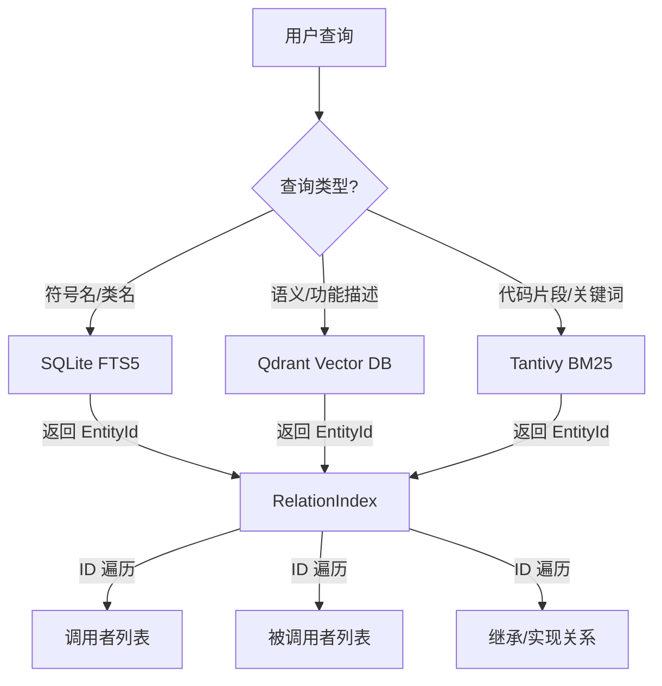

# 搜索与引用架构说明文档

## 1. 概述

本项目采用**分层存储与检索架构**，针对代码分析中的不同需求（语义搜索、关键词匹配、符号定位、关系追踪）分别采用了最合适的底层技术。核心原则是：**“入口靠搜索，关联靠 ID”**。

## 2. 核心技术组件

| 组件 | 技术选型 | 主要职责 | 索引对象 |
| :--- | :--- | :--- | :--- |
| **Qdrant** | 向量数据库 | 语义相似度搜索 (Semantic Search) | 代码块/实体的 Embedding 向量 |
| **Tantivy** | 嵌入式全文搜索引擎 | 高性能 BM25 关键词搜索 | 代码内容、自然语言描述 (NL) |
| **SQLite FTS5** | 关系型数据库虚拟表 | 元数据快速检索与模糊匹配 | 实体名称 (`name`)、签名 (`signature`) |
| **RelationIndex** | 内存哈希表 (DashMap) | O(1) 复杂关系网遍历 | `EntityId` -> `ResolvedRelation` |

## 3. 搜索流程设计

### 3.1 为什么需要 FTS5？
FTS5 的主要作用是作为**查询的入口点**。当用户通过 IDE 或命令行输入一个不完整的函数名（如 `auth_`）时：
1.  **高效性**：相比 SQL 的 `LIKE '%auth_%'`，FTS5 利用倒排索引能实现亚秒级响应。
2.  **灵活性**：支持前缀匹配、多词组合以及基于 TF-IDF 的相关度排序。
3.  **本地化**：作为 SQLite 的一部分，无需维护额外的搜索服务进程。

### 3.2 为什么不直接用 FTS5 查关系？
在查询“谁调用了这个函数”时，直接搜索 Name/Signature 存在严重缺陷：
*   **歧义性**：项目中可能存在多个同名函数（重载或不同文件下的同名）。
*   **性能瓶颈**：通过 Name Join 关系表会产生大量的临时计算和全表扫描。
*   **脆弱性**：一旦代码重构导致函数改名，基于字符串的关联就会断裂。

## 4. 引用关系查询的最佳实践

项目目前严格遵循**基于 ID 的关系查询**模式：

1.  **解析阶段**：通过 Tree-sitter 提取代码结构，为每个实体分配全局唯一的 `EntityId`。
2.  **建立索引**：在 `RelationIndex` 中维护 `callee_index`（被调用者 -> 调用者列表）。
3.  **查询执行**：
    *   **第一步（定位）**：使用 FTS5 或内存 `name_index` 将用户的关键词转化为 `Vec<EntityId>`。
    *   **第二步（关联）**：直接调用 `get_callers_by_callee_entity(entity_id)`。

这种设计确保了关系查询的时间复杂度稳定在 **O(1)** 或 **O(k)**（k 为调用者数量），不受项目总规模影响。

## 5. 架构图示

## 6. 改进总结

根据对现有代码的分析，我们完成了以下改进：
1.  **集成 FTS5**：在 SQLite 初始化时自动创建 `entities_fts` 虚拟表及同步触发器。
2.  **优化 Repo 层**：在 `EntityRepository` 中增加了 `search_fts` 方法，支持项目隔离的排名搜索。
3.  **明确边界**：确立了 FTS5 仅用于"找 ID"，而 `RelationIndex` 负责"查关系"的架构边界，消除了技术重叠带来的混淆。
4.  **API 集成**：新增 `/api/entities/search` 端点，提供基于 FTS5 的实体名称和签名搜索功能。
5.  **QueryCoordinator 集成**：在 QueryCoordinator 中添加 `search_entities()` 方法，统一查询入口。
6.  **工具层支持**：为 FindReferencesTool 添加 `resolve_symbol_by_name()` 方法，支持通过 FTS5 解析符号。

## 7. 结论

当前项目的搜索与引用架构是**合理且高效**的。FTS5、Tantivy 和 Qdrant 分别在元数据、文本内容和语义空间三个维度发挥作用，互不干扰且互为补充。通过强制使用 `EntityId` 进行关系跳转，系统在保证查询灵活性的同时，维持了极高的运行时性能。
